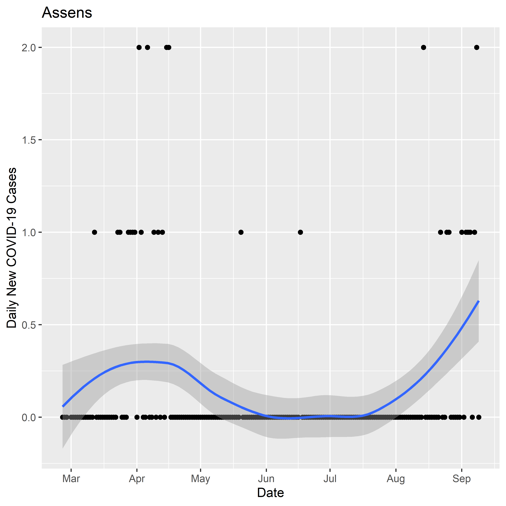
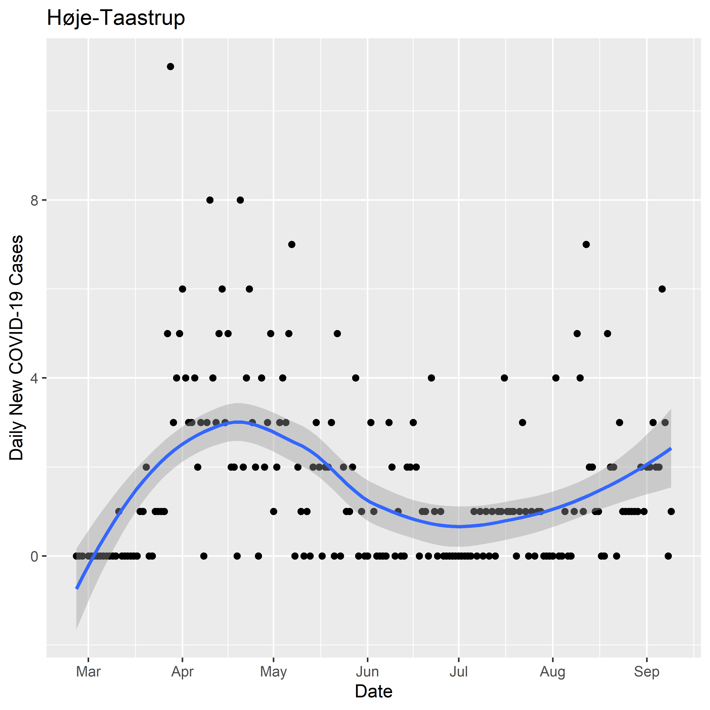
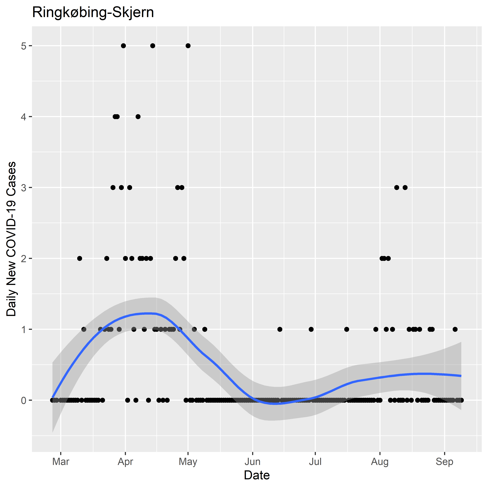
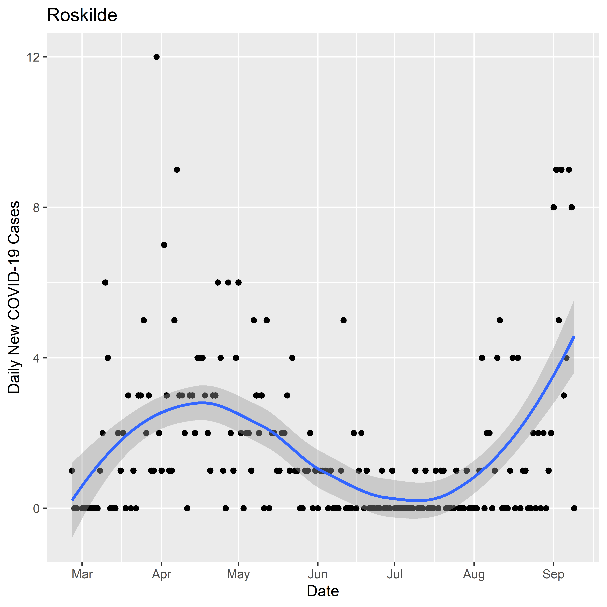

Daily New Cases of COVID-19 in Danish Municipalities
================
Tommi Suvitaival, <tommi.raimo.leo.suvitaival@regionh.dk>, Steno
Diabetes Center Copenhagen
2020-09-11

# Introduction

  - Municipality-level data of daily new cases of COVID-19 in Denmark
  - Data from Statens Serum Institut
      - at
        <https://www.ssi.dk/sygdomme-beredskab-og-forskning/sygdomsovervaagning/c/covid19-overvaagning>
      - behind “fil med overvågningsdata”

# Load Data

``` r
# Data from Statens Serum Institut
# at https://www.ssi.dk/sygdomme-beredskab-og-forskning/sygdomsovervaagning/c/covid19-overvaagning
# behind "fil med overvågningsdata"
# (Direct link:
#  https://files.ssi.dk/Data-Epidemiologiske-Rapport-10092020-77gf ;
#  accessed 11.9.2020.
# )

data.loaded <-
  readr::read_delim(
    file = "H:/projects/covid19/data/SSI/Municipality_cases_time_series.csv", 
    delim = ";",
    escape_double = FALSE,
    trim_ws = TRUE,
    col_names = TRUE
  )
```

    ## Parsed with column specification:
    ## cols(
    ##   .default = col_double(),
    ##   date_sample = col_date(format = "")
    ## )

    ## See spec(...) for full column specifications.

# Prepare Data

``` r
data <- data.loaded

data$"date_sample" <- lubridate::as_date( x = data$"date_sample" )
```

# Proportion of Municipalities with Daily New COVID-19 Cases

## Compute Values

``` r
data.plot <- data

data.plot$"Pcnt_municipalities_with_new_cases" <- 
  rowMeans( x = data[ , -1 ] > 0 ) * 100

data.plot$"Total_new_cases" <- rowSums( x = data[ , -1 ] )
```

``` r
breaks.date <-
  ggplot2::scale_x_date(
    breaks = as.Date( paste0( "2020-0", 3:9, "-01" ) ),
    date_labels = "%b"
  )
```

## Plot

``` r
ggplot2::ggplot(
  data = data.plot,
  mapping =
    ggplot2::aes(
      x = date_sample,
      y = Pcnt_municipalities_with_new_cases
    )
) +
  ggplot2::geom_point( mapping = ggplot2::aes( size = Total_new_cases ) ) +
  ggplot2::geom_smooth() +
  breaks.date +
  ggplot2::xlab( label = "Date" ) +
  ggplot2::ylab( label = "Proportion (%) of Danish Municipalities\nwith Daily New Cases of COVID-19" ) +
  ggplot2::guides( size = ggplot2::guide_legend( title = "Total Number of\nDaily New\nCOVID-19 Cases\nin Denmark" ) )
```

    ## `geom_smooth()` using method = 'loess' and formula 'y ~ x'

<!-- -->

# Cases by Municipality

## Convert Data into Long Format

``` r
data.plot <- 
  tidyr::pivot_longer( 
    data = data,
    cols = -1,
    names_to = "Municipality",
    values_to = "New_cases"
  )
```

## Plot

### All Municipalities

``` r
ggplot2::ggplot(
  data = data.plot,
  mapping =
    ggplot2::aes(
      x = date_sample,
      y = New_cases,
      color = Municipality
    )
) +
  ggplot2::geom_point( alpha = 0.25 ) +
  ggplot2::geom_smooth() +
  breaks.date +
  ggplot2::xlab( label = "Date" ) +
  ggplot2::ylab( label = "New Daily COVID-19 Cases" )
```

    ## `geom_smooth()` using method = 'loess' and formula 'y ~ x'

<!-- -->

## Municipalities Individually

``` r
municipalities <- unique( data.plot$"Municipality" )

municipalities <- sort( x = municipalities )

for ( i in 1:length( municipalities ) ) {
  
  plot.i <-
    ggplot2::ggplot(
      data = data.plot[ data.plot$"Municipality" == municipalities[ i ], ],
      mapping =
        ggplot2::aes(
          x = date_sample,
          y = New_cases,
        )
    ) +
    ggplot2::geom_point() +
    ggplot2::geom_smooth() +
    breaks.date +
    ggplot2::xlab( label = "Date" ) +
    ggplot2::ylab( label = "Daily New COVID-19 Cases" ) +
    ggplot2::ggtitle( label = municipalities[ i ] )
  
  print( plot.i )
  print( municipalities[ i ] )
  
}
```

    ## `geom_smooth()` using method = 'loess' and formula 'y ~ x'

<!-- -->

    ## [1] "Aabenraa"

    ## `geom_smooth()` using method = 'loess' and formula 'y ~ x'

<!-- -->

    ## [1] "Aalborg"

    ## `geom_smooth()` using method = 'loess' and formula 'y ~ x'

<!-- -->

    ## [1] "Aarhus"

    ## `geom_smooth()` using method = 'loess' and formula 'y ~ x'

<!-- -->

    ## [1] "Ærø"

    ## `geom_smooth()` using method = 'loess' and formula 'y ~ x'

<!-- -->

    ## [1] "Albertslund"

    ## `geom_smooth()` using method = 'loess' and formula 'y ~ x'

<!-- -->

    ## [1] "Allerød"

    ## `geom_smooth()` using method = 'loess' and formula 'y ~ x'

<!-- -->

    ## [1] "Assens"

    ## `geom_smooth()` using method = 'loess' and formula 'y ~ x'

<!-- -->

    ## [1] "Ballerup"

    ## `geom_smooth()` using method = 'loess' and formula 'y ~ x'

<!-- -->

    ## [1] "Billund"

    ## `geom_smooth()` using method = 'loess' and formula 'y ~ x'

<!-- -->

    ## [1] "Bornholm"

    ## `geom_smooth()` using method = 'loess' and formula 'y ~ x'

<!-- -->

    ## [1] "Brøndby"

    ## `geom_smooth()` using method = 'loess' and formula 'y ~ x'

<!-- -->

    ## [1] "Brønderslev"

    ## `geom_smooth()` using method = 'loess' and formula 'y ~ x'

<!-- -->

    ## [1] "Copenhagen"

    ## `geom_smooth()` using method = 'loess' and formula 'y ~ x'

<!-- -->

    ## [1] "Dragør"

    ## `geom_smooth()` using method = 'loess' and formula 'y ~ x'

<!-- -->

    ## [1] "Egedal"

    ## `geom_smooth()` using method = 'loess' and formula 'y ~ x'

<!-- -->

    ## [1] "Esbjerg"

    ## `geom_smooth()` using method = 'loess' and formula 'y ~ x'

<!-- -->

    ## [1] "Faaborg-Midtfyn"

    ## `geom_smooth()` using method = 'loess' and formula 'y ~ x'

<!-- -->

    ## [1] "Fanø"

    ## `geom_smooth()` using method = 'loess' and formula 'y ~ x'

<!-- -->

    ## [1] "Favrskov"

    ## `geom_smooth()` using method = 'loess' and formula 'y ~ x'

<!-- -->

    ## [1] "Faxe"

    ## `geom_smooth()` using method = 'loess' and formula 'y ~ x'

<!-- -->

    ## [1] "Fredensborg"

    ## `geom_smooth()` using method = 'loess' and formula 'y ~ x'

<!-- -->

    ## [1] "Fredericia"

    ## `geom_smooth()` using method = 'loess' and formula 'y ~ x'

<!-- -->

    ## [1] "Frederiksberg"

    ## `geom_smooth()` using method = 'loess' and formula 'y ~ x'

<!-- -->

    ## [1] "Frederikshavn"

    ## `geom_smooth()` using method = 'loess' and formula 'y ~ x'

<!-- -->

    ## [1] "Frederikssund"

    ## `geom_smooth()` using method = 'loess' and formula 'y ~ x'

<!-- -->

    ## [1] "Furesø"

    ## `geom_smooth()` using method = 'loess' and formula 'y ~ x'

<!-- -->

    ## [1] "Gentofte"

    ## `geom_smooth()` using method = 'loess' and formula 'y ~ x'

<!-- -->

    ## [1] "Gladsaxe"

    ## `geom_smooth()` using method = 'loess' and formula 'y ~ x'

<!-- -->

    ## [1] "Glostrup"

    ## `geom_smooth()` using method = 'loess' and formula 'y ~ x'

<!-- -->

    ## [1] "Greve"

    ## `geom_smooth()` using method = 'loess' and formula 'y ~ x'

<!-- -->

    ## [1] "Gribskov"

    ## `geom_smooth()` using method = 'loess' and formula 'y ~ x'

<!-- -->

    ## [1] "Guldborgsund"

    ## `geom_smooth()` using method = 'loess' and formula 'y ~ x'

<!-- -->

    ## [1] "Haderslev"

    ## `geom_smooth()` using method = 'loess' and formula 'y ~ x'

<!-- -->

    ## [1] "Halsnæs"

    ## `geom_smooth()` using method = 'loess' and formula 'y ~ x'

<!-- -->

    ## [1] "Hedensted"

    ## `geom_smooth()` using method = 'loess' and formula 'y ~ x'

<!-- -->

    ## [1] "Helsingør"

    ## `geom_smooth()` using method = 'loess' and formula 'y ~ x'

<!-- -->

    ## [1] "Herlev"

    ## `geom_smooth()` using method = 'loess' and formula 'y ~ x'

<!-- -->

    ## [1] "Herning"

    ## `geom_smooth()` using method = 'loess' and formula 'y ~ x'

<!-- -->

    ## [1] "Hillerød"

    ## `geom_smooth()` using method = 'loess' and formula 'y ~ x'

<!-- -->

    ## [1] "Hjørring"

    ## `geom_smooth()` using method = 'loess' and formula 'y ~ x'

<!-- -->

    ## [1] "Høje-Taastrup"

    ## `geom_smooth()` using method = 'loess' and formula 'y ~ x'

<!-- -->

    ## [1] "Holbæk"

    ## `geom_smooth()` using method = 'loess' and formula 'y ~ x'

<!-- -->

    ## [1] "Holstebro"

    ## `geom_smooth()` using method = 'loess' and formula 'y ~ x'

<!-- -->

    ## [1] "Horsens"

    ## `geom_smooth()` using method = 'loess' and formula 'y ~ x'

<!-- -->

    ## [1] "Hørsholm"

    ## `geom_smooth()` using method = 'loess' and formula 'y ~ x'

<!-- -->

    ## [1] "Hvidovre"

    ## `geom_smooth()` using method = 'loess' and formula 'y ~ x'

<!-- -->

    ## [1] "Ikast-Brande"

    ## `geom_smooth()` using method = 'loess' and formula 'y ~ x'

<!-- -->

    ## [1] "Ishøj"

    ## `geom_smooth()` using method = 'loess' and formula 'y ~ x'

<!-- -->

    ## [1] "Jammerbugt"

    ## `geom_smooth()` using method = 'loess' and formula 'y ~ x'

<!-- -->

    ## [1] "Kalundborg"

    ## `geom_smooth()` using method = 'loess' and formula 'y ~ x'

<!-- -->

    ## [1] "Kerteminde"

    ## `geom_smooth()` using method = 'loess' and formula 'y ~ x'

<!-- -->

    ## [1] "Køge"

    ## `geom_smooth()` using method = 'loess' and formula 'y ~ x'

<!-- -->

    ## [1] "Kolding"

    ## `geom_smooth()` using method = 'loess' and formula 'y ~ x'

<!-- -->

    ## [1] "Læsø"

    ## `geom_smooth()` using method = 'loess' and formula 'y ~ x'

<!-- -->

    ## [1] "Langeland"

    ## `geom_smooth()` using method = 'loess' and formula 'y ~ x'

<!-- -->

    ## [1] "Lejre"

    ## `geom_smooth()` using method = 'loess' and formula 'y ~ x'

<!-- -->

    ## [1] "Lemvig"

    ## `geom_smooth()` using method = 'loess' and formula 'y ~ x'

<!-- -->

    ## [1] "Lolland"

    ## `geom_smooth()` using method = 'loess' and formula 'y ~ x'

<!-- -->

    ## [1] "Lyngby-Taarbæk"

    ## `geom_smooth()` using method = 'loess' and formula 'y ~ x'

<!-- -->

    ## [1] "Mariagerfjord"

    ## `geom_smooth()` using method = 'loess' and formula 'y ~ x'

<!-- -->

    ## [1] "Middelfart"

    ## `geom_smooth()` using method = 'loess' and formula 'y ~ x'

<!-- -->

    ## [1] "Morsø"

    ## `geom_smooth()` using method = 'loess' and formula 'y ~ x'

<!-- -->

    ## [1] "Næstved"

    ## `geom_smooth()` using method = 'loess' and formula 'y ~ x'

<!-- -->

    ## [1] "Norddjurs"

    ## `geom_smooth()` using method = 'loess' and formula 'y ~ x'

<!-- -->

    ## [1] "Nordfyns"

    ## `geom_smooth()` using method = 'loess' and formula 'y ~ x'

<!-- -->

    ## [1] "Nyborg"

    ## `geom_smooth()` using method = 'loess' and formula 'y ~ x'

<!-- -->

    ## [1] "Odder"

    ## `geom_smooth()` using method = 'loess' and formula 'y ~ x'

<!-- -->

    ## [1] "Odense"

    ## `geom_smooth()` using method = 'loess' and formula 'y ~ x'

<!-- -->

    ## [1] "Odsherred"

    ## `geom_smooth()` using method = 'loess' and formula 'y ~ x'

<!-- -->

    ## [1] "Randers"

    ## `geom_smooth()` using method = 'loess' and formula 'y ~ x'

<!-- -->

    ## [1] "Rebild"

    ## `geom_smooth()` using method = 'loess' and formula 'y ~ x'

<!-- -->

    ## [1] "Ringkøbing-Skjern"

    ## `geom_smooth()` using method = 'loess' and formula 'y ~ x'

<!-- -->

    ## [1] "Ringsted"

    ## `geom_smooth()` using method = 'loess' and formula 'y ~ x'

<!-- -->

    ## [1] "Rødovre"

    ## `geom_smooth()` using method = 'loess' and formula 'y ~ x'

<!-- -->

    ## [1] "Roskilde"

    ## `geom_smooth()` using method = 'loess' and formula 'y ~ x'

<!-- -->

    ## [1] "Rudersdal"

    ## `geom_smooth()` using method = 'loess' and formula 'y ~ x'

<!-- -->

    ## [1] "Silkeborg"

    ## `geom_smooth()` using method = 'loess' and formula 'y ~ x'

<!-- -->

    ## [1] "Skanderborg"

    ## `geom_smooth()` using method = 'loess' and formula 'y ~ x'

<!-- -->

    ## [1] "Skive"

    ## `geom_smooth()` using method = 'loess' and formula 'y ~ x'

<!-- -->

    ## [1] "Slagelse"

    ## `geom_smooth()` using method = 'loess' and formula 'y ~ x'

<!-- -->

    ## [1] "Solrød"

    ## `geom_smooth()` using method = 'loess' and formula 'y ~ x'

<!-- -->

    ## [1] "Sønderborg"

    ## `geom_smooth()` using method = 'loess' and formula 'y ~ x'

<!-- -->

    ## [1] "Sorø"

    ## `geom_smooth()` using method = 'loess' and formula 'y ~ x'

<!-- -->

    ## [1] "Stevns"

    ## `geom_smooth()` using method = 'loess' and formula 'y ~ x'

<!-- -->

    ## [1] "Struer"

    ## `geom_smooth()` using method = 'loess' and formula 'y ~ x'

<!-- -->

    ## [1] "Svendborg"

    ## `geom_smooth()` using method = 'loess' and formula 'y ~ x'

<!-- -->

    ## [1] "Syddjurs"

    ## `geom_smooth()` using method = 'loess' and formula 'y ~ x'

<!-- -->

    ## [1] "Tårnby"

    ## `geom_smooth()` using method = 'loess' and formula 'y ~ x'

<!-- -->

    ## [1] "Thisted"

    ## `geom_smooth()` using method = 'loess' and formula 'y ~ x'

<!-- -->

    ## [1] "Tønder"

    ## `geom_smooth()` using method = 'loess' and formula 'y ~ x'

<!-- -->

    ## [1] "Vallensbæk"

    ## `geom_smooth()` using method = 'loess' and formula 'y ~ x'

<!-- -->

    ## [1] "Varde"

    ## `geom_smooth()` using method = 'loess' and formula 'y ~ x'

<!-- -->

    ## [1] "Vejen"

    ## `geom_smooth()` using method = 'loess' and formula 'y ~ x'

<!-- -->

    ## [1] "Vejle"

    ## `geom_smooth()` using method = 'loess' and formula 'y ~ x'

<!-- -->

    ## [1] "Vesthimmerlands"

    ## `geom_smooth()` using method = 'loess' and formula 'y ~ x'

<!-- -->

    ## [1] "Viborg"

    ## `geom_smooth()` using method = 'loess' and formula 'y ~ x'

<!-- -->

    ## [1] "Vordingborg"

# SessionInfo

``` r
utils::sessionInfo()
```

    ## R version 3.6.2 (2019-12-12)
    ## Platform: x86_64-w64-mingw32/x64 (64-bit)
    ## Running under: Windows 10 x64 (build 17763)
    ## 
    ## Matrix products: default
    ## 
    ## locale:
    ## [1] LC_COLLATE=English_United States.1252 
    ## [2] LC_CTYPE=English_United States.1252   
    ## [3] LC_MONETARY=English_United States.1252
    ## [4] LC_NUMERIC=C                          
    ## [5] LC_TIME=English_United States.1252    
    ## 
    ## attached base packages:
    ## [1] stats     graphics  grDevices utils     datasets  methods   base     
    ## 
    ## loaded via a namespace (and not attached):
    ##  [1] Rcpp_1.0.3       pillar_1.4.3     compiler_3.6.2   tools_3.6.2     
    ##  [5] digest_0.6.23    lubridate_1.7.9  evaluate_0.14    lifecycle_0.2.0 
    ##  [9] tibble_3.0.1     gtable_0.3.0     pkgconfig_2.0.3  rlang_0.4.6     
    ## [13] yaml_2.2.0       xfun_0.12        stringr_1.4.0    dplyr_0.8.3     
    ## [17] knitr_1.27       generics_0.0.2   vctrs_0.2.4      hms_0.5.3       
    ## [21] grid_3.6.2       tidyselect_1.0.0 glue_1.3.1       R6_2.4.1        
    ## [25] rmarkdown_2.1    ggplot2_3.2.1    readr_1.3.1      purrr_0.3.3     
    ## [29] farver_2.0.3     tidyr_1.0.0      magrittr_1.5     scales_1.1.0    
    ## [33] ellipsis_0.3.0   htmltools_0.4.0  assertthat_0.2.1 colorspace_1.4-1
    ## [37] labeling_0.3     stringi_1.4.4    lazyeval_0.2.2   munsell_0.5.0   
    ## [41] crayon_1.3.4
