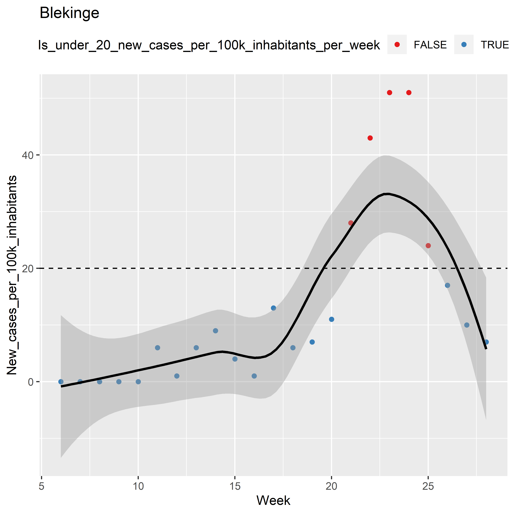
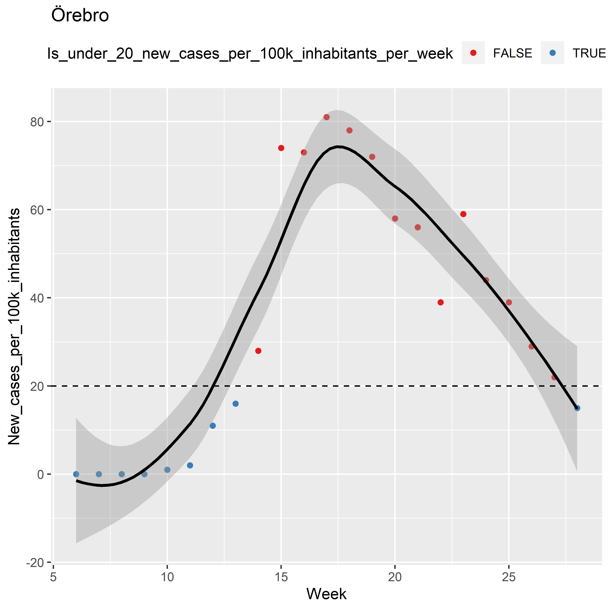

Registered COVID-19 Cases by Region in Sweden
================
Tommi Suvitaival, <tommi.raimo.leo.suvitaival@regionh.dk>, Steno
Diabetes Center Copenhagen
2020-07-21

# Load Data

``` r
# Load data of registered COVID-19 cases.
# Data from Folkhälsomyndigheten at
# https://www.folkhalsomyndigheten.se/smittskydd-beredskap/utbrott/aktuella-utbrott/covid-19/statistik-och-analyser/bekraftade-fall-i-sverige/ 
# under the link "Data som statistiken ovan bygger på kan laddas ner här (Excel)"
# ( https://www.arcgis.com/sharing/rest/content/items/b5e7488e117749c19881cce45db13f7e/data )

data.cases.loaded <-
  readxl::read_excel(
    path = "H:/projects/covid19/data/Folkhalsomyndigheten/Folkhalsomyndigheten_Covid19.xlsx",
    sheet = "Veckodata Region"
  )
```

# Prepare Data

## Compute Criterion of Severity

``` r
data <- data.cases.loaded

data$Is_under_20_new_cases_per_100k_inhabitants_per_week <-
  data$"Antal_fall_100000inv_vecka" < 20
```

## Translate

``` r
colnames( data )[ colnames( data ) == "Antal_fall_vecka" ] <-
  "New_cases"

colnames( data )[ colnames( data ) == "Kum_antal_fall" ] <-
  "Cumulative_cases"

colnames( data )[ colnames( data ) == "Antal_intensivvårdade_vecka" ] <-
  "Cases_in_ICU"

colnames( data )[ colnames( data ) == "Kum_antal_intensivvårdade" ] <-
  "Cumulative_ICU_treated"

colnames( data )[ colnames( data ) == "Antal_avlidna_vecka" ] <-
  "New_deaths"

colnames( data )[ colnames( data ) == "Kum_antal_avlidna" ] <-
  "Cumulative_deaths"

colnames( data )[ colnames( data ) == "Antal_fall_100000inv_vecka" ] <-
  "New_cases_per_100k_inhabitants"

colnames( data )[ colnames( data ) == "Kum_fall_100000inv" ] <-
  "Cumulative_cases_per_100k_inhabitants"

colnames( data )[ colnames( data ) == "veckonummer" ] <-
  "Week"
```

# Figures

## Cases By 100,000 Inhabitants

### All Regions

``` r
ggplot2::ggplot(
  data = data,
  mapping =
    ggplot2::aes(
      x = Week,
      y = New_cases_per_100k_inhabitants,
      color = Region,
      shape = Region
    )
) +
  ggplot2::geom_point() +
  ggplot2::geom_smooth( se = FALSE ) +
  ggplot2::geom_hline(
    yintercept = 20,
    linetype = "dashed"
  ) +
  ggplot2::scale_shape_manual( values = LETTERS )
```

    ## `geom_smooth()` using method = 'loess' and formula 'y ~ x'

<!-- -->

## By Region

### Data Points Only

``` r
ggplot2::ggplot(
  data = data,
  mapping =
    ggplot2::aes(
      x = Week,
      y = New_cases_per_100k_inhabitants,
      color = Is_under_20_new_cases_per_100k_inhabitants_per_week,
      group = Region
    )
) +
  ggplot2::geom_point() +
  ggplot2::geom_hline(
    yintercept = 20,
    linetype = "dashed"
  ) +
  ggplot2::scale_color_brewer( palette = "Set1" ) +
  ggplot2::theme( legend.position = "top" ) +
  ggplot2::facet_wrap(facets = ggplot2::vars( Region ) )
```

<!-- -->

### With Smoothing

``` r
ggplot2::ggplot(
  data = data,
  mapping =
    ggplot2::aes(
      x = Week,
      y = New_cases_per_100k_inhabitants,
      color = Is_under_20_new_cases_per_100k_inhabitants_per_week,
      group = Region
    )
) +
  ggplot2::geom_point() +
  ggplot2::geom_smooth(
    color = "gray",
    alpha = 0.25
  ) +
  ggplot2::geom_hline( 
    yintercept = 20,
    linetype = "dashed"
  ) +
  ggplot2::scale_color_brewer( palette = "Set1" ) +
  ggplot2::theme_bw() +
  ggplot2::theme( legend.position = "top" ) +
  ggplot2::facet_wrap(facets = ggplot2::vars( Region ) )
```

    ## `geom_smooth()` using method = 'loess' and formula 'y ~ x'

<!-- -->

## By Region in Individual Figures

``` r
regions <- sort( unique ( data$"Region" ) )

for ( i in 1:length( unique( regions ) ) ) {

  plot.i <-
    ggplot2::ggplot(
      data = data[ data$"Region" == regions[ i ], ],
      mapping =
        ggplot2::aes(
          x = Week,
          y = New_cases_per_100k_inhabitants,
          color = Is_under_20_new_cases_per_100k_inhabitants_per_week,
          group = Region
        )
    ) +
    ggplot2::geom_point() +
    ggplot2::geom_smooth(
      color = "black"
    ) +
    ggplot2::geom_hline( 
      yintercept = 20,
      linetype = "dashed"
    ) +
    ggplot2::scale_color_brewer( palette = "Set1" ) +
    ggplot2::theme( legend.position = "top" ) +
    ggplot2::ggtitle( label = regions[ i ] )

  print( plot.i )
  
}
```

    ## `geom_smooth()` using method = 'loess' and formula 'y ~ x'

<!-- -->

    ## `geom_smooth()` using method = 'loess' and formula 'y ~ x'

<!-- -->

    ## `geom_smooth()` using method = 'loess' and formula 'y ~ x'

<!-- -->

    ## `geom_smooth()` using method = 'loess' and formula 'y ~ x'

<!-- -->

    ## `geom_smooth()` using method = 'loess' and formula 'y ~ x'

<!-- -->

    ## `geom_smooth()` using method = 'loess' and formula 'y ~ x'

<!-- -->

    ## `geom_smooth()` using method = 'loess' and formula 'y ~ x'

<!-- -->

    ## `geom_smooth()` using method = 'loess' and formula 'y ~ x'

<!-- -->

    ## `geom_smooth()` using method = 'loess' and formula 'y ~ x'

<!-- -->

    ## `geom_smooth()` using method = 'loess' and formula 'y ~ x'

<!-- -->

    ## `geom_smooth()` using method = 'loess' and formula 'y ~ x'

<!-- -->

    ## `geom_smooth()` using method = 'loess' and formula 'y ~ x'

<!-- -->

    ## `geom_smooth()` using method = 'loess' and formula 'y ~ x'

<!-- -->

    ## `geom_smooth()` using method = 'loess' and formula 'y ~ x'

<!-- -->

    ## `geom_smooth()` using method = 'loess' and formula 'y ~ x'

<!-- -->

    ## `geom_smooth()` using method = 'loess' and formula 'y ~ x'

<!-- -->

    ## `geom_smooth()` using method = 'loess' and formula 'y ~ x'

<!-- -->

    ## `geom_smooth()` using method = 'loess' and formula 'y ~ x'

<!-- -->

    ## `geom_smooth()` using method = 'loess' and formula 'y ~ x'

<!-- -->

    ## `geom_smooth()` using method = 'loess' and formula 'y ~ x'

<!-- -->

    ## `geom_smooth()` using method = 'loess' and formula 'y ~ x'

<!-- -->

# Appendix

``` r
utils::sessionInfo()
```

    ## R version 3.6.2 (2019-12-12)
    ## Platform: x86_64-w64-mingw32/x64 (64-bit)
    ## Running under: Windows 10 x64 (build 17763)
    ## 
    ## Matrix products: default
    ## 
    ## locale:
    ## [1] LC_COLLATE=English_United States.1252 
    ## [2] LC_CTYPE=English_United States.1252   
    ## [3] LC_MONETARY=English_United States.1252
    ## [4] LC_NUMERIC=C                          
    ## [5] LC_TIME=English_United States.1252    
    ## 
    ## attached base packages:
    ## [1] stats     graphics  grDevices utils     datasets  methods   base     
    ## 
    ## loaded via a namespace (and not attached):
    ##  [1] Rcpp_1.0.3         knitr_1.27         magrittr_1.5       tidyselect_1.0.0  
    ##  [5] munsell_0.5.0      colorspace_1.4-1   R6_2.4.1           rlang_0.4.6       
    ##  [9] dplyr_0.8.3        stringr_1.4.0      tools_3.6.2        grid_3.6.2        
    ## [13] gtable_0.3.0       xfun_0.12          htmltools_0.4.0    ellipsis_0.3.0    
    ## [17] assertthat_0.2.1   lazyeval_0.2.2     yaml_2.2.0         readxl_1.3.1      
    ## [21] digest_0.6.23      tibble_3.0.1       lifecycle_0.2.0    crayon_1.3.4      
    ## [25] RColorBrewer_1.1-2 farver_2.0.3       purrr_0.3.3        ggplot2_3.2.1     
    ## [29] vctrs_0.2.4        glue_1.3.1         evaluate_0.14      rmarkdown_2.1     
    ## [33] labeling_0.3       stringi_1.4.4      compiler_3.6.2     pillar_1.4.3      
    ## [37] cellranger_1.1.0   scales_1.1.0       pkgconfig_2.0.3
