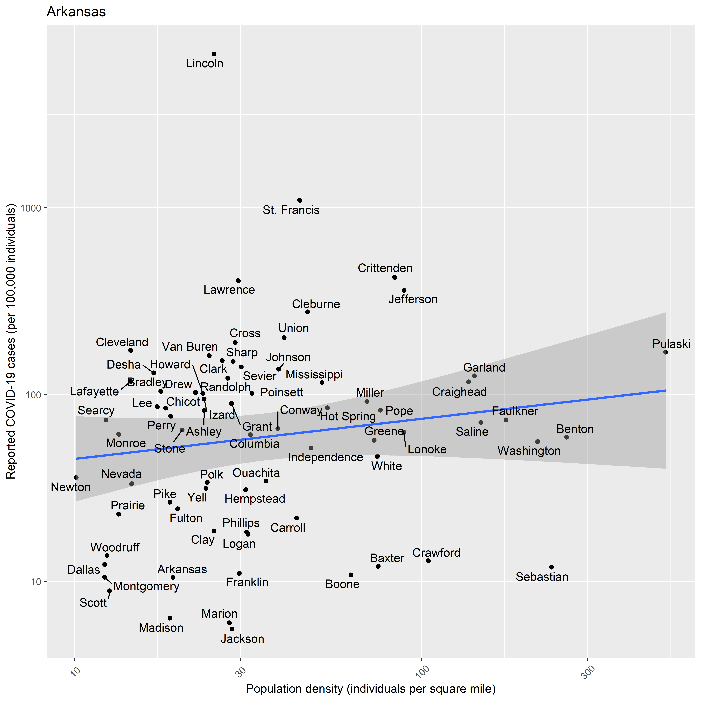
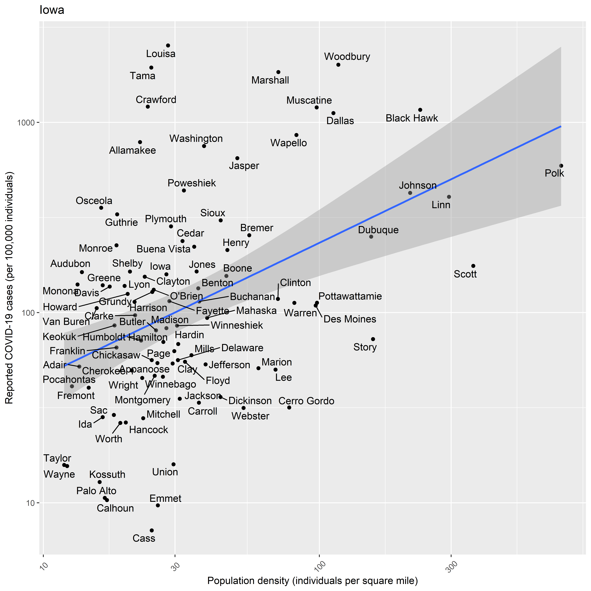
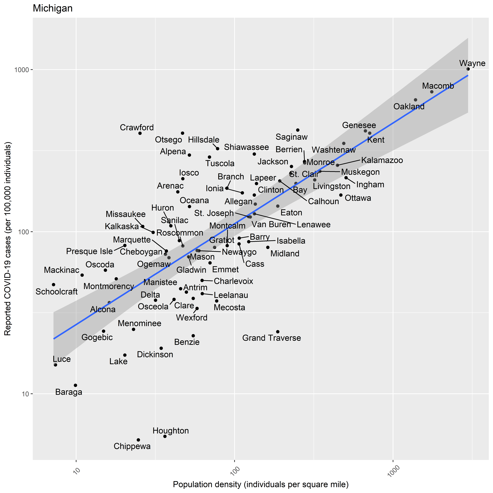
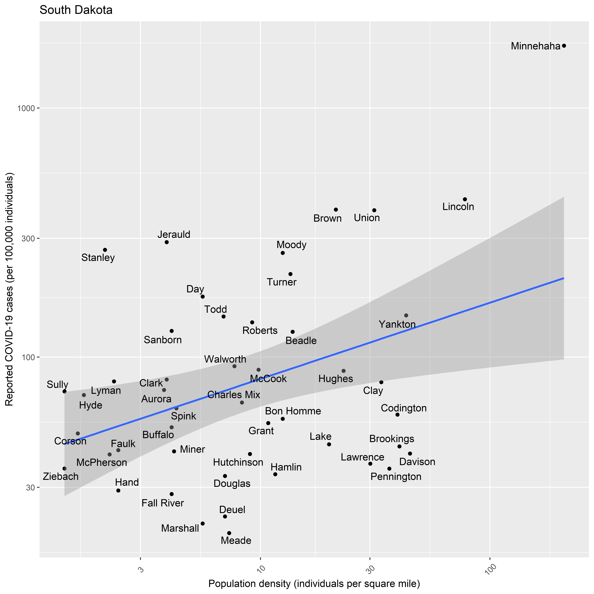
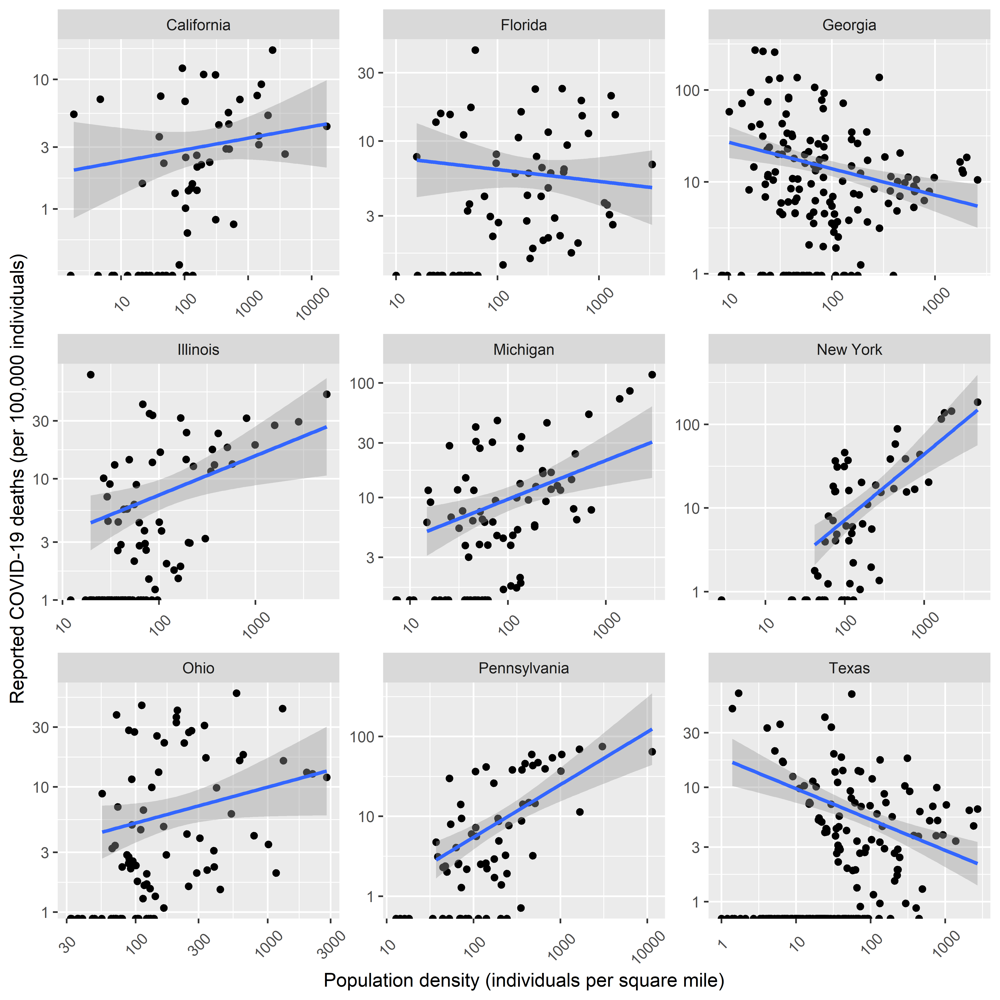

COVID-19 Cases in the US Counties
================
Tommi Suvitaival, <tommi.raimo.leo.suvitaival@regionh.dk>, Steno
Diabetes Center Copenhagen
2020-05-15

# Introduction

  - County-level COVID-19 data from New York Times
  - County-level population data from US
Census

# Load Data

## Census

``` r
# Source: https://www2.census.gov/library/publications/2011/compendia/usa-counties/excel/POP01.xls",

N.sheets <- 10

data.census.loaded <-
  lapply(
    X = 1:N.sheets,
    FUN =
      function( x ) {
        readxl::read_excel(
          path = "H:/projects/covid19/data/US_Census/POP01.xls",
          sheet = x
        )
      }
  )

# Source: https://www2.census.gov/library/publications/2011/compendia/usa-counties/excel/Mastdata.xls

mastdata.census <-
  readxl::read_excel(
    path = "H:/projects/covid19/data/US_Census/Mastdata.xls",
  )


data.census <- data.census.loaded[[ 1 ]]

for ( i in 2:length( data.census.loaded ) ) {
  
  data.census <-
    merge(
      x = data.census,
      y = data.census.loaded[[ i ]][ , -1 ],
      by = "STCOU",
      all = TRUE
    )
  
}

tmp <-
  match(
    table = mastdata.census$"Item_Id",
    x = colnames( data.census )
  )

data.census.orig <- data.census

colnames( data.census )[ !is.na( tmp ) ] <-
  unlist( mastdata.census[ tmp[ !is.na( tmp ) ], "Item_Description" ] )
```

## COVID-19

``` r
data.covid.loaded <-
  readr::read_csv(
    file = "https://raw.githubusercontent.com/nytimes/covid-19-data/master/us-counties.csv"
  )
```

    ## Parsed with column specification:
    ## cols(
    ##   date = col_date(format = ""),
    ##   county = col_character(),
    ##   state = col_character(),
    ##   fips = col_character(),
    ##   cases = col_double(),
    ##   deaths = col_double()
    ## )

``` r
# View( data.covid.loaded )
```

``` r
data.covid <-
  by(
    data = data.covid.loaded,
    INDICES = data.covid.loaded$"fips",
    FUN =
      function( x ) {
        as.data.frame( x[ which.max( x$"date" ), ] )
      }
  )

data.covid <- dplyr::bind_rows( data.covid )

data.covid <-
  merge(
    x = data.covid,
    y = USAboundaries::state_codes,
    by.x = "state",
    by.y = "state_name",
    all.x = TRUE,
    all.y = FALSE
  )

data.covid$"County_State" <-
  paste(
    data.covid$"county",
    data.covid$"state_abbr",
    sep = ", "
  )
```

## Merge

``` r
data <-
  merge(
    x = data.covid,
    y = data.census,
    by.x = "County_State",
    by.y = "Area_name",
    all = FALSE
  )

data$"Deaths_per_Capita" <-
  data$"deaths" / data$"Resident population (April 1 - complete count) 2010"

data$"Deaths_per_100k" <- data$"Deaths_per_Capita" * 100000

data$"Cases_per_Capita" <-
  data$"cases" / data$"Resident population (April 1 - complete count) 2010"

data$"Cases_per_100k" <- data$"Cases_per_Capita" * 100000
```

# Figures

## Cases per Capita v. Population Density

### All States

``` r
data.plot <- data
colnames( data.plot ) <- make.names( colnames( data.plot ) )

ggplot2::ggplot(
  data = data.plot,
  mapping =
    ggplot2::aes(
      x = Population.per.square.mile.2010,
      y = Cases_per_100k,
    )
) +
  ggplot2::geom_point( alpha = 0.25 ) +
  ggplot2::geom_smooth( method = "lm" ) +
  ggplot2::scale_x_log10() +
  ggplot2::scale_y_log10() +
  ggplot2::xlab( label = "Population density (individuals per square mile)" ) + 
  ggplot2::ylab( label = "Reported COVID-19 cases (per 100,000 individuals)" ) +
  ggplot2::theme(
    axis.text.x =
      ggplot2::element_text(
        angle = 45,
        vjust = 0.5
      )
  ) +
  ggplot2::facet_wrap( facets = ggplot2::vars( state ) )
```

<!-- -->

``` r
# data.plot <- data
# colnames( data.plot ) <- make.names( colnames( data.plot ) )

ggplot2::ggplot(
  data = data.plot,
  mapping =
    ggplot2::aes(
      x = Population.per.square.mile.2010,
      y = Cases_per_100k,
    )
) +
  ggplot2::geom_point( alpha = 0.25 ) +
  ggplot2::geom_smooth( method = "lm" ) +
  ggplot2::scale_x_log10() +
  ggplot2::scale_y_log10() +
  ggplot2::xlab( label = "Population density (individuals per square mile)" ) + 
  ggplot2::ylab( label = "Reported COVID-19 cases (per 100,000 individuals)" ) +
  ggplot2::theme(
    axis.text.x =
      ggplot2::element_text(
        angle = 45,
        vjust = 0.5
      )
  ) +
  ggplot2::facet_wrap(
    facets = ggplot2::vars( state ),
    scales = "free"
  )
```

<!-- -->

### Most Populous States

``` r
pop.by.state <-
  tapply(
    X = data.plot$"Resident.population..April.1...complete.count..2010",
    INDEX = data.plot$"state",
    FUN = sum
  )

top.states <- names( sort( x = pop.by.state, decreasing = TRUE ) )[ 1:9 ]

ggplot2::ggplot(
  data = data.plot[ data.plot$"state" %in% top.states, ],
  mapping =
    ggplot2::aes(
      x = Population.per.square.mile.2010,
      y = Cases_per_100k
    )
) +
  ggplot2::geom_point() +
  ggplot2::geom_smooth( method = "lm" ) +
  ggplot2::scale_x_log10() +
  ggplot2::scale_y_log10() +
  ggplot2::xlab( label = "Population density (individuals per square mile)" ) + 
  ggplot2::ylab( label = "Reported COVID-19 cases (per 100,000 individuals)" ) +
  ggplot2::theme(
    axis.text.x =
      ggplot2::element_text(
        angle = 45,
        vjust = 0.5
      )
  ) +
  ggplot2::facet_wrap(
    facets = ggplot2::vars( state ),
    scales = "free"
  )
```

<!-- -->

``` r
ggplot2::ggplot(
  data = data.plot[ data.plot$"state" %in% top.states, ],
  mapping =
    ggplot2::aes(
      x = Population.per.square.mile.2010,
      y = Cases_per_100k
    )
) +
  ggplot2::geom_point() +
  ggplot2::geom_smooth( method = "lm" ) +
  ggplot2::scale_x_log10() +
  ggplot2::scale_y_log10() +
  ggplot2::xlab( label = "Population density (individuals per square mile)" ) + 
  ggplot2::ylab( label = "Reported COVID-19 cases (per 100,000 individuals)" ) +
  ggplot2::theme( 
    axis.text.x = 
      ggplot2::element_text(
        angle = 45,
        vjust = 0.5
      )
  ) +
  ggplot2::facet_wrap(
    facets = ggplot2::vars( state )
  )
```

<!-- -->

``` r
pop.by.state <-
  tapply(
    X = data.plot$"Resident.population..April.1...complete.count..2010",
    INDEX = data.plot$"state",
    FUN = sum
  )

top.states <- names( sort( x = pop.by.state, decreasing = TRUE ) )[ 1:4 ]

ggplot2::ggplot(
  data = data.plot[ data.plot$"state" %in% top.states, ],
  mapping =
    ggplot2::aes(
      x = Population.per.square.mile.2010,
      y = Cases_per_100k
    )
) +
  ggplot2::geom_point() +
  ggplot2::geom_smooth( method = "lm" ) +
  ggplot2::scale_x_log10() +
  ggplot2::scale_y_log10() +
  ggplot2::xlab( label = "Population density (individuals per square mile)" ) + 
  ggplot2::ylab( label = "Reported COVID-19 cases (per 100,000 individuals)" ) +
  ggplot2::theme(
    axis.text.x =
      ggplot2::element_text(
        angle = 45,
        vjust = 0.5
      )
  ) +
  ggplot2::facet_wrap(
    facets = ggplot2::vars( state ),
    scales = "free",
    ncol = 2
  )
```

<!-- -->

``` r
ggplot2::ggplot(
  data = data.plot[ data.plot$"state" %in% top.states, ],
  mapping =
    ggplot2::aes(
      x = Population.per.square.mile.2010,
      y = Cases_per_100k,
      label = county
    )
) +
  ggplot2::geom_point( alpha = 0.25 ) +
  ggplot2::geom_smooth( method = "lm" ) +
  ggplot2::scale_x_log10() +
  ggplot2::scale_y_log10() +
  ggplot2::xlab( label = "Population density (individuals per square mile)" ) + 
  ggplot2::ylab( label = "Reported COVID-19 cases (per 100,000 individuals)" ) +
  ggplot2::theme(
    axis.text.x =
      ggplot2::element_text(
        angle = 45,
        vjust = 0.5
      )
  ) +
  ggplot2::facet_wrap(
    facets = ggplot2::vars( state ),
    scales = "free",
    ncol = 2
  ) +
  ggrepel::geom_text_repel()
```

<!-- -->

### By State

``` r
states <- sort( unique( data.plot$"state" ) )

data.plot$"Cases_per_Capita_log" <- log10( data.plot$"Cases_per_Capita" )

data.plot$"Population.per.square.mile.2010.log" <-
  log10( data.plot$"Population.per.square.mile.2010" )

for ( i in 1:length( states ) ) {

  state.i <- states[ i ]

  data.plot.i <- data.plot[ data.plot$state == state.i, ]

  plot.i <-
    ggplot2::ggplot(
      data = data.plot.i,
      mapping =
        ggplot2::aes(
          x = Population.per.square.mile.2010,
          y = Cases_per_100k,
          label = county
        )
    ) +
    ggplot2::geom_point() +
    ggplot2::geom_smooth( method = "lm" ) +
    ggplot2::scale_x_log10() +
    ggplot2::scale_y_log10() +
    ggplot2::xlab( label = "Population density (individuals per square mile)" ) +
    ggplot2::ylab( label = "Reported COVID-19 cases (per 100,000 individuals)" ) +
    ggplot2::theme(
      axis.text.x =
        ggplot2::element_text(
          angle = 45,
          vjust = 0.5
        )
    ) +
    ggrepel::geom_text_repel() +
    ggplot2::ggtitle( label = state.i )

  print( plot.i )

  print(
    summary(
      lm(
        formula = Cases_per_Capita_log ~ Population.per.square.mile.2010.log,
        data = data.plot.i
      )
    )
  )

}
```

<!-- -->

    ## 
    ## Call:
    ## lm(formula = Cases_per_Capita_log ~ Population.per.square.mile.2010.log, 
    ##     data = data.plot.i)
    ## 
    ## Residuals:
    ##      Min       1Q   Median       3Q      Max 
    ## -0.68140 -0.22904 -0.03041  0.20985  0.66097 
    ## 
    ## Coefficients:
    ##                                     Estimate Std. Error t value Pr(>|t|)    
    ## (Intercept)                          -2.2239     0.1722 -12.915   <2e-16 ***
    ## Population.per.square.mile.2010.log  -0.2620     0.0959  -2.732   0.0081 ** 
    ## ---
    ## Signif. codes:  0 '***' 0.001 '**' 0.01 '*' 0.05 '.' 0.1 ' ' 1
    ## 
    ## Residual standard error: 0.325 on 65 degrees of freedom
    ## Multiple R-squared:  0.103,  Adjusted R-squared:  0.08918 
    ## F-statistic: 7.462 on 1 and 65 DF,  p-value: 0.008104

<!-- -->

    ## 
    ## Call:
    ## lm(formula = Cases_per_Capita_log ~ Population.per.square.mile.2010.log, 
    ##     data = data.plot.i)
    ## 
    ## Residuals:
    ## ALL 1 residuals are 0: no residual degrees of freedom!
    ## 
    ## Coefficients: (1 not defined because of singularities)
    ##                                     Estimate Std. Error t value Pr(>|t|)
    ## (Intercept)                           -3.173         NA      NA       NA
    ## Population.per.square.mile.2010.log       NA         NA      NA       NA
    ## 
    ## Residual standard error: NaN on 0 degrees of freedom

<!-- -->

    ## 
    ## Call:
    ## lm(formula = Cases_per_Capita_log ~ Population.per.square.mile.2010.log, 
    ##     data = data.plot.i)
    ## 
    ## Residuals:
    ##      Min       1Q   Median       3Q      Max 
    ## -0.75276 -0.24332 -0.04119  0.09713  0.92948 
    ## 
    ## Coefficients:
    ##                                      Estimate Std. Error t value Pr(>|t|)    
    ## (Intercept)                         -2.875736   0.354302  -8.117 1.91e-06 ***
    ## Population.per.square.mile.2010.log  0.005041   0.251805   0.020    0.984    
    ## ---
    ## Signif. codes:  0 '***' 0.001 '**' 0.01 '*' 0.05 '.' 0.1 ' ' 1
    ## 
    ## Residual standard error: 0.5206 on 13 degrees of freedom
    ## Multiple R-squared:  3.083e-05,  Adjusted R-squared:  -0.07689 
    ## F-statistic: 0.0004008 on 1 and 13 DF,  p-value: 0.9843

<!-- -->

    ## 
    ## Call:
    ## lm(formula = Cases_per_Capita_log ~ Population.per.square.mile.2010.log, 
    ##     data = data.plot.i)
    ## 
    ## Residuals:
    ##      Min       1Q   Median       3Q      Max 
    ## -1.00861 -0.32249  0.07156  0.28054  2.08154 
    ## 
    ## Coefficients:
    ##                                     Estimate Std. Error t value Pr(>|t|)    
    ## (Intercept)                          -3.5591     0.2771 -12.842   <2e-16 ***
    ## Population.per.square.mile.2010.log   0.2150     0.1739   1.237     0.22    
    ## ---
    ## Signif. codes:  0 '***' 0.001 '**' 0.01 '*' 0.05 '.' 0.1 ' ' 1
    ## 
    ## Residual standard error: 0.5392 on 71 degrees of freedom
    ## Multiple R-squared:  0.02108,    Adjusted R-squared:  0.007294 
    ## F-statistic: 1.529 on 1 and 71 DF,  p-value: 0.2203

<!-- -->

    ## 
    ## Call:
    ## lm(formula = Cases_per_Capita_log ~ Population.per.square.mile.2010.log, 
    ##     data = data.plot.i)
    ## 
    ## Residuals:
    ##      Min       1Q   Median       3Q      Max 
    ## -1.40309 -0.24067  0.01072  0.23456  0.93925 
    ## 
    ## Coefficients:
    ##                                     Estimate Std. Error t value Pr(>|t|)    
    ## (Intercept)                         -3.74982    0.16863 -22.237  < 2e-16 ***
    ## Population.per.square.mile.2010.log  0.26296    0.07602   3.459  0.00108 ** 
    ## ---
    ## Signif. codes:  0 '***' 0.001 '**' 0.01 '*' 0.05 '.' 0.1 ' ' 1
    ## 
    ## Residual standard error: 0.4649 on 53 degrees of freedom
    ## Multiple R-squared:  0.1842, Adjusted R-squared:  0.1688 
    ## F-statistic: 11.97 on 1 and 53 DF,  p-value: 0.001077

<!-- -->

    ## 
    ## Call:
    ## lm(formula = Cases_per_Capita_log ~ Population.per.square.mile.2010.log, 
    ##     data = data.plot.i)
    ## 
    ## Residuals:
    ##      Min       1Q   Median       3Q      Max 
    ## -1.05181 -0.29689 -0.01664  0.27248  1.13496 
    ## 
    ## Coefficients:
    ##                                     Estimate Std. Error t value Pr(>|t|)    
    ## (Intercept)                         -3.01943    0.11283 -26.760   <2e-16 ***
    ## Population.per.square.mile.2010.log  0.19162    0.07766   2.467   0.0166 *  
    ## ---
    ## Signif. codes:  0 '***' 0.001 '**' 0.01 '*' 0.05 '.' 0.1 ' ' 1
    ## 
    ## Residual standard error: 0.4891 on 58 degrees of freedom
    ## Multiple R-squared:  0.095,  Adjusted R-squared:  0.0794 
    ## F-statistic: 6.088 on 1 and 58 DF,  p-value: 0.01658

<!-- -->

    ## 
    ## Call:
    ## lm(formula = Cases_per_Capita_log ~ Population.per.square.mile.2010.log, 
    ##     data = data.plot.i)
    ## 
    ## Residuals:
    ##      Min       1Q   Median       3Q      Max 
    ## -0.20874 -0.09355 -0.02250  0.04432  0.31439 
    ## 
    ## Coefficients:
    ##                                     Estimate Std. Error t value Pr(>|t|)    
    ## (Intercept)                          -4.0431     0.5272  -7.669 0.000257 ***
    ## Population.per.square.mile.2010.log   0.6574     0.1911   3.441 0.013786 *  
    ## ---
    ## Signif. codes:  0 '***' 0.001 '**' 0.01 '*' 0.05 '.' 0.1 ' ' 1
    ## 
    ## Residual standard error: 0.1759 on 6 degrees of freedom
    ## Multiple R-squared:  0.6637, Adjusted R-squared:  0.6076 
    ## F-statistic: 11.84 on 1 and 6 DF,  p-value: 0.01379

<!-- -->

    ## 
    ## Call:
    ## lm(formula = Cases_per_Capita_log ~ Population.per.square.mile.2010.log, 
    ##     data = data.plot.i)
    ## 
    ## Residuals:
    ##     1341     1862     2471 
    ## -0.18255  0.02789  0.15466 
    ## 
    ## Coefficients:
    ##                                     Estimate Std. Error t value Pr(>|t|)
    ## (Intercept)                          -0.6254     1.0748  -0.582    0.665
    ## Population.per.square.mile.2010.log  -0.5599     0.4064  -1.378    0.400
    ## 
    ## Residual standard error: 0.2409 on 1 degrees of freedom
    ## Multiple R-squared:  0.6549, Adjusted R-squared:  0.3099 
    ## F-statistic: 1.898 on 1 and 1 DF,  p-value: 0.3997

<!-- -->

    ## 
    ## Call:
    ## lm(formula = Cases_per_Capita_log ~ Population.per.square.mile.2010.log, 
    ##     data = data.plot.i)
    ## 
    ## Residuals:
    ##      Min       1Q   Median       3Q      Max 
    ## -1.22568 -0.21460 -0.03494  0.22827  1.38724 
    ## 
    ## Coefficients:
    ##                                     Estimate Std. Error t value Pr(>|t|)    
    ## (Intercept)                         -3.09848    0.17776 -17.431   <2e-16 ***
    ## Population.per.square.mile.2010.log  0.08544    0.07964   1.073    0.287    
    ## ---
    ## Signif. codes:  0 '***' 0.001 '**' 0.01 '*' 0.05 '.' 0.1 ' ' 1
    ## 
    ## Residual standard error: 0.3829 on 65 degrees of freedom
    ## Multiple R-squared:  0.0174, Adjusted R-squared:  0.002281 
    ## F-statistic: 1.151 on 1 and 65 DF,  p-value: 0.2873

<!-- -->

    ## 
    ## Call:
    ## lm(formula = Cases_per_Capita_log ~ Population.per.square.mile.2010.log, 
    ##     data = data.plot.i)
    ## 
    ## Residuals:
    ##      Min       1Q   Median       3Q      Max 
    ## -0.91280 -0.23308 -0.01648  0.20164  0.91329 
    ## 
    ## Coefficients:
    ##                                     Estimate Std. Error t value Pr(>|t|)    
    ## (Intercept)                         -2.52183    0.11357 -22.204   <2e-16 ***
    ## Population.per.square.mile.2010.log -0.04074    0.05761  -0.707     0.48    
    ## ---
    ## Signif. codes:  0 '***' 0.001 '**' 0.01 '*' 0.05 '.' 0.1 ' ' 1
    ## 
    ## Residual standard error: 0.3784 on 157 degrees of freedom
    ## Multiple R-squared:  0.003176,   Adjusted R-squared:  -0.003174 
    ## F-statistic: 0.5002 on 1 and 157 DF,  p-value: 0.4805

<!-- -->

    ## 
    ## Call:
    ## lm(formula = Cases_per_Capita_log ~ Population.per.square.mile.2010.log, 
    ##     data = data.plot.i)
    ## 
    ## Residuals:
    ##     1107     1159     1330     1655 
    ## -0.03903 -0.02996 -0.15627  0.22526 
    ## 
    ## Coefficients:
    ##                                     Estimate Std. Error t value Pr(>|t|)  
    ## (Intercept)                         -3.37600    0.40018  -8.436   0.0138 *
    ## Population.per.square.mile.2010.log  0.01368    0.17198   0.080   0.9439  
    ## ---
    ## Signif. codes:  0 '***' 0.001 '**' 0.01 '*' 0.05 '.' 0.1 ' ' 1
    ## 
    ## Residual standard error: 0.197 on 2 degrees of freedom
    ## Multiple R-squared:  0.003152,   Adjusted R-squared:  -0.4953 
    ## F-statistic: 0.006324 on 1 and 2 DF,  p-value: 0.9439

<!-- -->

    ## 
    ## Call:
    ## lm(formula = Cases_per_Capita_log ~ Population.per.square.mile.2010.log, 
    ##     data = data.plot.i)
    ## 
    ## Residuals:
    ##      Min       1Q   Median       3Q      Max 
    ## -0.83635 -0.41249  0.00457  0.28357  1.60356 
    ## 
    ## Coefficients:
    ##                                     Estimate Std. Error t value Pr(>|t|)    
    ## (Intercept)                          -3.3369     0.1899 -17.571   <2e-16 ***
    ## Population.per.square.mile.2010.log   0.1193     0.1411   0.846    0.404    
    ## ---
    ## Signif. codes:  0 '***' 0.001 '**' 0.01 '*' 0.05 '.' 0.1 ' ' 1
    ## 
    ## Residual standard error: 0.5465 on 31 degrees of freedom
    ## Multiple R-squared:  0.02255,    Adjusted R-squared:  -0.00898 
    ## F-statistic: 0.7152 on 1 and 31 DF,  p-value: 0.4042

<!-- -->

    ## 
    ## Call:
    ## lm(formula = Cases_per_Capita_log ~ Population.per.square.mile.2010.log, 
    ##     data = data.plot.i)
    ## 
    ## Residuals:
    ##     Min      1Q  Median      3Q     Max 
    ## -0.9971 -0.2840  0.0089  0.2426  0.9982 
    ## 
    ## Coefficients:
    ##                                     Estimate Std. Error t value Pr(>|t|)    
    ## (Intercept)                         -4.07702    0.16390 -24.875  < 2e-16 ***
    ## Population.per.square.mile.2010.log  0.57678    0.08642   6.674 1.55e-09 ***
    ## ---
    ## Signif. codes:  0 '***' 0.001 '**' 0.01 '*' 0.05 '.' 0.1 ' ' 1
    ## 
    ## Residual standard error: 0.4215 on 97 degrees of freedom
    ## Multiple R-squared:  0.3147, Adjusted R-squared:  0.3077 
    ## F-statistic: 44.55 on 1 and 97 DF,  p-value: 1.545e-09

<!-- -->

    ## 
    ## Call:
    ## lm(formula = Cases_per_Capita_log ~ Population.per.square.mile.2010.log, 
    ##     data = data.plot.i)
    ## 
    ## Residuals:
    ##      Min       1Q   Median       3Q      Max 
    ## -0.93002 -0.22586  0.01795  0.24393  1.31013 
    ## 
    ## Coefficients:
    ##                                     Estimate Std. Error t value Pr(>|t|)    
    ## (Intercept)                          -3.2481     0.2082 -15.598  < 2e-16 ***
    ## Population.per.square.mile.2010.log   0.2716     0.1009   2.693  0.00844 ** 
    ## ---
    ## Signif. codes:  0 '***' 0.001 '**' 0.01 '*' 0.05 '.' 0.1 ' ' 1
    ## 
    ## Residual standard error: 0.3726 on 90 degrees of freedom
    ## Multiple R-squared:  0.07458,    Adjusted R-squared:  0.06429 
    ## F-statistic: 7.253 on 1 and 90 DF,  p-value: 0.008443

<!-- -->

    ## 
    ## Call:
    ## lm(formula = Cases_per_Capita_log ~ Population.per.square.mile.2010.log, 
    ##     data = data.plot.i)
    ## 
    ## Residuals:
    ##      Min       1Q   Median       3Q      Max 
    ## -1.08676 -0.31451 -0.06177  0.29920  1.42110 
    ## 
    ## Coefficients:
    ##                                     Estimate Std. Error t value Pr(>|t|)    
    ## (Intercept)                          -4.0333     0.2403 -16.785  < 2e-16 ***
    ## Population.per.square.mile.2010.log   0.7003     0.1525   4.593 1.37e-05 ***
    ## ---
    ## Signif. codes:  0 '***' 0.001 '**' 0.01 '*' 0.05 '.' 0.1 ' ' 1
    ## 
    ## Residual standard error: 0.5112 on 93 degrees of freedom
    ## Multiple R-squared:  0.1849, Adjusted R-squared:  0.1761 
    ## F-statistic:  21.1 on 1 and 93 DF,  p-value: 1.367e-05

<!-- -->

    ## 
    ## Call:
    ## lm(formula = Cases_per_Capita_log ~ Population.per.square.mile.2010.log, 
    ##     data = data.plot.i)
    ## 
    ## Residuals:
    ##      Min       1Q   Median       3Q      Max 
    ## -0.99686 -0.34554 -0.00041  0.20793  1.64791 
    ## 
    ## Coefficients:
    ##                                     Estimate Std. Error t value Pr(>|t|)    
    ## (Intercept)                         -3.11663    0.15245 -20.443   <2e-16 ***
    ## Population.per.square.mile.2010.log  0.02026    0.11219   0.181    0.857    
    ## ---
    ## Signif. codes:  0 '***' 0.001 '**' 0.01 '*' 0.05 '.' 0.1 ' ' 1
    ## 
    ## Residual standard error: 0.5927 on 81 degrees of freedom
    ## Multiple R-squared:  0.0004024,  Adjusted R-squared:  -0.01194 
    ## F-statistic: 0.0326 on 1 and 81 DF,  p-value: 0.8572

<!-- -->

    ## 
    ## Call:
    ## lm(formula = Cases_per_Capita_log ~ Population.per.square.mile.2010.log, 
    ##     data = data.plot.i)
    ## 
    ## Residuals:
    ##      Min       1Q   Median       3Q      Max 
    ## -1.24221 -0.28504  0.00709  0.23087  1.52169 
    ## 
    ## Coefficients:
    ##                                     Estimate Std. Error t value Pr(>|t|)    
    ## (Intercept)                          -3.7776     0.2412 -15.662   <2e-16 ***
    ## Population.per.square.mile.2010.log   0.3076     0.1272   2.417   0.0173 *  
    ## ---
    ## Signif. codes:  0 '***' 0.001 '**' 0.01 '*' 0.05 '.' 0.1 ' ' 1
    ## 
    ## Residual standard error: 0.4856 on 111 degrees of freedom
    ## Multiple R-squared:  0.05001,    Adjusted R-squared:  0.04145 
    ## F-statistic: 5.844 on 1 and 111 DF,  p-value: 0.01726

<!-- -->

    ## 
    ## Call:
    ## lm(formula = Cases_per_Capita_log ~ Population.per.square.mile.2010.log, 
    ##     data = data.plot.i)
    ## 
    ## Residuals:
    ##      Min       1Q   Median       3Q      Max 
    ## -0.97187 -0.24514  0.03805  0.24500  0.60685 
    ## 
    ## Coefficients:
    ##                                     Estimate Std. Error t value Pr(>|t|)    
    ## (Intercept)                         -2.96625    0.17223 -17.222  < 2e-16 ***
    ## Population.per.square.mile.2010.log  0.31218    0.09146   3.413  0.00115 ** 
    ## ---
    ## Signif. codes:  0 '***' 0.001 '**' 0.01 '*' 0.05 '.' 0.1 ' ' 1
    ## 
    ## Residual standard error: 0.3666 on 61 degrees of freedom
    ## Multiple R-squared:  0.1604, Adjusted R-squared:  0.1466 
    ## F-statistic: 11.65 on 1 and 61 DF,  p-value: 0.001145

<!-- -->

    ## 
    ## Call:
    ## lm(formula = Cases_per_Capita_log ~ Population.per.square.mile.2010.log, 
    ##     data = data.plot.i)
    ## 
    ## Residuals:
    ##      Min       1Q   Median       3Q      Max 
    ## -0.43416 -0.17700 -0.07076  0.15081  0.67456 
    ## 
    ## Coefficients:
    ##                                     Estimate Std. Error t value Pr(>|t|)    
    ## (Intercept)                          -4.5918     0.2461 -18.661 2.75e-11 ***
    ## Population.per.square.mile.2010.log   0.7319     0.1394   5.251 0.000123 ***
    ## ---
    ## Signif. codes:  0 '***' 0.001 '**' 0.01 '*' 0.05 '.' 0.1 ' ' 1
    ## 
    ## Residual standard error: 0.2975 on 14 degrees of freedom
    ## Multiple R-squared:  0.6632, Adjusted R-squared:  0.6392 
    ## F-statistic: 27.57 on 1 and 14 DF,  p-value: 0.0001227

<!-- -->

    ## 
    ## Call:
    ## lm(formula = Cases_per_Capita_log ~ Population.per.square.mile.2010.log, 
    ##     data = data.plot.i)
    ## 
    ## Residuals:
    ##      Min       1Q   Median       3Q      Max 
    ## -0.91954 -0.13483 -0.02868  0.21598  0.49731 
    ## 
    ## Coefficients:
    ##                                     Estimate Std. Error t value Pr(>|t|)    
    ## (Intercept)                          -3.3627     0.2842 -11.832 5.21e-11 ***
    ## Population.per.square.mile.2010.log   0.3489     0.1104   3.159  0.00455 ** 
    ## ---
    ## Signif. codes:  0 '***' 0.001 '**' 0.01 '*' 0.05 '.' 0.1 ' ' 1
    ## 
    ## Residual standard error: 0.2928 on 22 degrees of freedom
    ## Multiple R-squared:  0.3121, Adjusted R-squared:  0.2809 
    ## F-statistic: 9.982 on 1 and 22 DF,  p-value: 0.004545

<!-- -->

    ## 
    ## Call:
    ## lm(formula = Cases_per_Capita_log ~ Population.per.square.mile.2010.log, 
    ##     data = data.plot.i)
    ## 
    ## Residuals:
    ##      Min       1Q   Median       3Q      Max 
    ## -0.50996 -0.07013  0.02443  0.16069  0.25638 
    ## 
    ## Coefficients:
    ##                                     Estimate Std. Error t value Pr(>|t|)    
    ## (Intercept)                          -3.7122     0.3378 -10.989 1.28e-07 ***
    ## Population.per.square.mile.2010.log   0.5496     0.1186   4.634 0.000576 ***
    ## ---
    ## Signif. codes:  0 '***' 0.001 '**' 0.01 '*' 0.05 '.' 0.1 ' ' 1
    ## 
    ## Residual standard error: 0.2366 on 12 degrees of freedom
    ## Multiple R-squared:  0.6415, Adjusted R-squared:  0.6116 
    ## F-statistic: 21.47 on 1 and 12 DF,  p-value: 0.0005765

<!-- -->

    ## 
    ## Call:
    ## lm(formula = Cases_per_Capita_log ~ Population.per.square.mile.2010.log, 
    ##     data = data.plot.i)
    ## 
    ## Residuals:
    ##      Min       1Q   Median       3Q      Max 
    ## -1.03829 -0.16408  0.00812  0.14530  0.92946 
    ## 
    ## Coefficients:
    ##                                     Estimate Std. Error t value Pr(>|t|)    
    ## (Intercept)                         -4.19460    0.13924 -30.125  < 2e-16 ***
    ## Population.per.square.mile.2010.log  0.62190    0.07021   8.857 2.26e-13 ***
    ## ---
    ## Signif. codes:  0 '***' 0.001 '**' 0.01 '*' 0.05 '.' 0.1 ' ' 1
    ## 
    ## Residual standard error: 0.3315 on 77 degrees of freedom
    ## Multiple R-squared:  0.5047, Adjusted R-squared:  0.4982 
    ## F-statistic: 78.45 on 1 and 77 DF,  p-value: 2.261e-13

<!-- -->

    ## 
    ## Call:
    ## lm(formula = Cases_per_Capita_log ~ Population.per.square.mile.2010.log, 
    ##     data = data.plot.i)
    ## 
    ## Residuals:
    ##      Min       1Q   Median       3Q      Max 
    ## -0.97693 -0.27401 -0.01771  0.26324  1.90785 
    ## 
    ## Coefficients:
    ##                                     Estimate Std. Error t value Pr(>|t|)    
    ## (Intercept)                          -3.6140     0.1519 -23.795  < 2e-16 ***
    ## Population.per.square.mile.2010.log   0.3301     0.0918   3.596 0.000551 ***
    ## ---
    ## Signif. codes:  0 '***' 0.001 '**' 0.01 '*' 0.05 '.' 0.1 ' ' 1
    ## 
    ## Residual standard error: 0.4791 on 82 degrees of freedom
    ## Multiple R-squared:  0.1362, Adjusted R-squared:  0.1257 
    ## F-statistic: 12.93 on 1 and 82 DF,  p-value: 0.0005513

<!-- -->

    ## 
    ## Call:
    ## lm(formula = Cases_per_Capita_log ~ Population.per.square.mile.2010.log, 
    ##     data = data.plot.i)
    ## 
    ## Residuals:
    ##      Min       1Q   Median       3Q      Max 
    ## -0.95122 -0.18683  0.01589  0.25828  0.75215 
    ## 
    ## Coefficients:
    ##                                     Estimate Std. Error t value Pr(>|t|)    
    ## (Intercept)                          -2.1021     0.1926 -10.914   <2e-16 ***
    ## Population.per.square.mile.2010.log  -0.2504     0.1140  -2.196    0.031 *  
    ## ---
    ## Signif. codes:  0 '***' 0.001 '**' 0.01 '*' 0.05 '.' 0.1 ' ' 1
    ## 
    ## Residual standard error: 0.339 on 79 degrees of freedom
    ## Multiple R-squared:  0.05754,    Adjusted R-squared:  0.04562 
    ## F-statistic: 4.824 on 1 and 79 DF,  p-value: 0.031

<!-- -->

    ## 
    ## Call:
    ## lm(formula = Cases_per_Capita_log ~ Population.per.square.mile.2010.log, 
    ##     data = data.plot.i)
    ## 
    ## Residuals:
    ##      Min       1Q   Median       3Q      Max 
    ## -1.15423 -0.27638  0.00851  0.21753  1.38648 
    ## 
    ## Coefficients:
    ##                                     Estimate Std. Error t value Pr(>|t|)    
    ## (Intercept)                         -3.89486    0.14384 -27.078  < 2e-16 ***
    ## Population.per.square.mile.2010.log  0.32885    0.08301   3.962 0.000141 ***
    ## ---
    ## Signif. codes:  0 '***' 0.001 '**' 0.01 '*' 0.05 '.' 0.1 ' ' 1
    ## 
    ## Residual standard error: 0.4139 on 98 degrees of freedom
    ## Multiple R-squared:  0.138,  Adjusted R-squared:  0.1293 
    ## F-statistic:  15.7 on 1 and 98 DF,  p-value: 0.0001412

<!-- -->

    ## 
    ## Call:
    ## lm(formula = Cases_per_Capita_log ~ Population.per.square.mile.2010.log, 
    ##     data = data.plot.i)
    ## 
    ## Residuals:
    ##      Min       1Q   Median       3Q      Max 
    ## -0.81463 -0.16981 -0.04026  0.14302  1.07709 
    ## 
    ## Coefficients:
    ##                                     Estimate Std. Error t value Pr(>|t|)    
    ## (Intercept)                          -3.2649     0.1376 -23.719   <2e-16 ***
    ## Population.per.square.mile.2010.log  -0.1699     0.1457  -1.166    0.253    
    ## ---
    ## Signif. codes:  0 '***' 0.001 '**' 0.01 '*' 0.05 '.' 0.1 ' ' 1
    ## 
    ## Residual standard error: 0.4068 on 28 degrees of freedom
    ## Multiple R-squared:  0.04633,    Adjusted R-squared:  0.01227 
    ## F-statistic:  1.36 on 1 and 28 DF,  p-value: 0.2533

<!-- -->

    ## 
    ## Call:
    ## lm(formula = Cases_per_Capita_log ~ Population.per.square.mile.2010.log, 
    ##     data = data.plot.i)
    ## 
    ## Residuals:
    ##     Min      1Q  Median      3Q     Max 
    ## -1.1129 -0.3468 -0.0539  0.3452  1.3909 
    ## 
    ## Coefficients:
    ##                                     Estimate Std. Error t value Pr(>|t|)    
    ## (Intercept)                          -3.4097     0.1685 -20.241  < 2e-16 ***
    ## Population.per.square.mile.2010.log   0.4595     0.1290   3.562  0.00069 ***
    ## ---
    ## Signif. codes:  0 '***' 0.001 '**' 0.01 '*' 0.05 '.' 0.1 ' ' 1
    ## 
    ## Residual standard error: 0.5796 on 66 degrees of freedom
    ## Multiple R-squared:  0.1612, Adjusted R-squared:  0.1485 
    ## F-statistic: 12.69 on 1 and 66 DF,  p-value: 0.0006898

<!-- -->

    ## 
    ## Call:
    ## lm(formula = Cases_per_Capita_log ~ Population.per.square.mile.2010.log, 
    ##     data = data.plot.i)
    ## 
    ## Residuals:
    ##      Min       1Q   Median       3Q      Max 
    ## -0.59646 -0.31306 -0.04264  0.24314  0.71301 
    ## 
    ## Coefficients:
    ##                                     Estimate Std. Error t value Pr(>|t|)    
    ## (Intercept)                          -3.1089     0.1691 -18.380 4.89e-09 ***
    ## Population.per.square.mile.2010.log   0.1255     0.1495   0.839    0.421    
    ## ---
    ## Signif. codes:  0 '***' 0.001 '**' 0.01 '*' 0.05 '.' 0.1 ' ' 1
    ## 
    ## Residual standard error: 0.4347 on 10 degrees of freedom
    ## Multiple R-squared:  0.06582,    Adjusted R-squared:  -0.0276 
    ## F-statistic: 0.7046 on 1 and 10 DF,  p-value: 0.4209

<!-- -->

    ## 
    ## Call:
    ## lm(formula = Cases_per_Capita_log ~ Population.per.square.mile.2010.log, 
    ##     data = data.plot.i)
    ## 
    ## Residuals:
    ##      Min       1Q   Median       3Q      Max 
    ## -0.26460 -0.17130 -0.04064  0.16169  0.36332 
    ## 
    ## Coefficients:
    ##                                     Estimate Std. Error t value Pr(>|t|)    
    ## (Intercept)                          -5.3113     0.3705 -14.334 5.48e-07 ***
    ## Population.per.square.mile.2010.log   1.0734     0.1743   6.158 0.000272 ***
    ## ---
    ## Signif. codes:  0 '***' 0.001 '**' 0.01 '*' 0.05 '.' 0.1 ' ' 1
    ## 
    ## Residual standard error: 0.2351 on 8 degrees of freedom
    ## Multiple R-squared:  0.8258, Adjusted R-squared:  0.804 
    ## F-statistic: 37.92 on 1 and 8 DF,  p-value: 0.0002716

<!-- -->

    ## 
    ## Call:
    ## lm(formula = Cases_per_Capita_log ~ Population.per.square.mile.2010.log, 
    ##     data = data.plot.i)
    ## 
    ## Residuals:
    ##      Min       1Q   Median       3Q      Max 
    ## -0.24052 -0.06564  0.02343  0.05621  0.25710 
    ## 
    ## Coefficients:
    ##                                     Estimate Std. Error t value Pr(>|t|)    
    ## (Intercept)                         -3.16797    0.17127 -18.497 1.31e-13 ***
    ## Population.per.square.mile.2010.log  0.40184    0.05544   7.248 7.03e-07 ***
    ## ---
    ## Signif. codes:  0 '***' 0.001 '**' 0.01 '*' 0.05 '.' 0.1 ' ' 1
    ## 
    ## Residual standard error: 0.1263 on 19 degrees of freedom
    ## Multiple R-squared:  0.7344, Adjusted R-squared:  0.7204 
    ## F-statistic: 52.54 on 1 and 19 DF,  p-value: 7.027e-07

<!-- -->

    ## 
    ## Call:
    ## lm(formula = Cases_per_Capita_log ~ Population.per.square.mile.2010.log, 
    ##     data = data.plot.i)
    ## 
    ## Residuals:
    ##     Min      1Q  Median      3Q     Max 
    ## -0.9493 -0.3174 -0.0860  0.1949  1.4540 
    ## 
    ## Coefficients:
    ##                                     Estimate Std. Error t value Pr(>|t|)    
    ## (Intercept)                         -3.16256    0.17402 -18.174   <2e-16 ***
    ## Population.per.square.mile.2010.log  0.07153    0.14817   0.483    0.633    
    ## ---
    ## Signif. codes:  0 '***' 0.001 '**' 0.01 '*' 0.05 '.' 0.1 ' ' 1
    ## 
    ## Residual standard error: 0.5503 on 27 degrees of freedom
    ## Multiple R-squared:  0.008559,   Adjusted R-squared:  -0.02816 
    ## F-statistic: 0.2331 on 1 and 27 DF,  p-value: 0.6331

<!-- -->

    ## 
    ## Call:
    ## lm(formula = Cases_per_Capita_log ~ Population.per.square.mile.2010.log, 
    ##     data = data.plot.i)
    ## 
    ## Residuals:
    ##      Min       1Q   Median       3Q      Max 
    ## -0.82852 -0.26491 -0.05086  0.23303  0.95820 
    ## 
    ## Coefficients:
    ##                                     Estimate Std. Error t value Pr(>|t|)    
    ## (Intercept)                         -3.97493    0.19893 -19.981  < 2e-16 ***
    ## Population.per.square.mile.2010.log  0.62100    0.08946   6.941  4.7e-09 ***
    ## ---
    ## Signif. codes:  0 '***' 0.001 '**' 0.01 '*' 0.05 '.' 0.1 ' ' 1
    ## 
    ## Residual standard error: 0.3732 on 55 degrees of freedom
    ## Multiple R-squared:  0.467,  Adjusted R-squared:  0.4573 
    ## F-statistic: 48.18 on 1 and 55 DF,  p-value: 4.703e-09

<!-- -->

    ## 
    ## Call:
    ## lm(formula = Cases_per_Capita_log ~ Population.per.square.mile.2010.log, 
    ##     data = data.plot.i)
    ## 
    ## Residuals:
    ##      Min       1Q   Median       3Q      Max 
    ## -1.25976 -0.30424  0.03755  0.27258  0.86324 
    ## 
    ## Coefficients:
    ##                                     Estimate Std. Error t value Pr(>|t|)    
    ## (Intercept)                         -3.39531    0.20807 -16.318   <2e-16 ***
    ## Population.per.square.mile.2010.log  0.20291    0.09818   2.067   0.0414 *  
    ## ---
    ## Signif. codes:  0 '***' 0.001 '**' 0.01 '*' 0.05 '.' 0.1 ' ' 1
    ## 
    ## Residual standard error: 0.403 on 97 degrees of freedom
    ## Multiple R-squared:  0.04218,    Adjusted R-squared:  0.0323 
    ## F-statistic: 4.272 on 1 and 97 DF,  p-value: 0.04142

<!-- -->

    ## 
    ## Call:
    ## lm(formula = Cases_per_Capita_log ~ Population.per.square.mile.2010.log, 
    ##     data = data.plot.i)
    ## 
    ## Residuals:
    ##     Min      1Q  Median      3Q     Max 
    ## -0.8053 -0.2916 -0.1019  0.1298  0.8812 
    ## 
    ## Coefficients:
    ##                                     Estimate Std. Error t value Pr(>|t|)    
    ## (Intercept)                          -3.2357     0.1307 -24.754   <2e-16 ***
    ## Population.per.square.mile.2010.log   0.1350     0.1489   0.906    0.371    
    ## ---
    ## Signif. codes:  0 '***' 0.001 '**' 0.01 '*' 0.05 '.' 0.1 ' ' 1
    ## 
    ## Residual standard error: 0.4155 on 37 degrees of freedom
    ## Multiple R-squared:  0.02172,    Adjusted R-squared:  -0.004718 
    ## F-statistic: 0.8215 on 1 and 37 DF,  p-value: 0.3706

<!-- -->

    ## 
    ## Call:
    ## lm(formula = Cases_per_Capita_log ~ Population.per.square.mile.2010.log, 
    ##     data = data.plot.i)
    ## 
    ## Residuals:
    ##      Min       1Q   Median       3Q      Max 
    ## -0.96336 -0.20339 -0.04644  0.20451  1.64208 
    ## 
    ## Coefficients:
    ##                                     Estimate Std. Error t value Pr(>|t|)    
    ## (Intercept)                          -3.9439     0.2347 -16.805  < 2e-16 ***
    ## Population.per.square.mile.2010.log   0.4144     0.1050   3.948 0.000161 ***
    ## ---
    ## Signif. codes:  0 '***' 0.001 '**' 0.01 '*' 0.05 '.' 0.1 ' ' 1
    ## 
    ## Residual standard error: 0.4198 on 86 degrees of freedom
    ## Multiple R-squared:  0.1534, Adjusted R-squared:  0.1436 
    ## F-statistic: 15.58 on 1 and 86 DF,  p-value: 0.0001609

<!-- -->

    ## 
    ## Call:
    ## lm(formula = Cases_per_Capita_log ~ Population.per.square.mile.2010.log, 
    ##     data = data.plot.i)
    ## 
    ## Residuals:
    ##      Min       1Q   Median       3Q      Max 
    ## -1.04844 -0.29604 -0.03117  0.19509  1.65088 
    ## 
    ## Coefficients:
    ##                                     Estimate Std. Error t value Pr(>|t|)    
    ## (Intercept)                          -3.4634     0.1749 -19.799   <2e-16 ***
    ## Population.per.square.mile.2010.log   0.1728     0.1117   1.547    0.126    
    ## ---
    ## Signif. codes:  0 '***' 0.001 '**' 0.01 '*' 0.05 '.' 0.1 ' ' 1
    ## 
    ## Residual standard error: 0.489 on 69 degrees of freedom
    ## Multiple R-squared:  0.03354,    Adjusted R-squared:  0.01953 
    ## F-statistic: 2.394 on 1 and 69 DF,  p-value: 0.1263

<!-- -->

    ## 
    ## Call:
    ## lm(formula = Cases_per_Capita_log ~ Population.per.square.mile.2010.log, 
    ##     data = data.plot.i)
    ## 
    ## Residuals:
    ##      Min       1Q   Median       3Q      Max 
    ## -0.76533 -0.21989 -0.01078  0.30872  0.61663 
    ## 
    ## Coefficients:
    ##                                     Estimate Std. Error t value Pr(>|t|)    
    ## (Intercept)                         -3.79191    0.13458 -28.176  < 2e-16 ***
    ## Population.per.square.mile.2010.log  0.27864    0.08308   3.354  0.00211 ** 
    ## ---
    ## Signif. codes:  0 '***' 0.001 '**' 0.01 '*' 0.05 '.' 0.1 ' ' 1
    ## 
    ## Residual standard error: 0.3582 on 31 degrees of freedom
    ## Multiple R-squared:  0.2662, Adjusted R-squared:  0.2426 
    ## F-statistic: 11.25 on 1 and 31 DF,  p-value: 0.002115

<!-- -->

    ## 
    ## Call:
    ## lm(formula = Cases_per_Capita_log ~ Population.per.square.mile.2010.log, 
    ##     data = data.plot.i)
    ## 
    ## Residuals:
    ##      Min       1Q   Median       3Q      Max 
    ## -1.07408 -0.25293 -0.00081  0.34312  0.91107 
    ## 
    ## Coefficients:
    ##                                     Estimate Std. Error t value Pr(>|t|)    
    ## (Intercept)                         -4.35767    0.21168 -20.586  < 2e-16 ***
    ## Population.per.square.mile.2010.log  0.66361    0.09335   7.109 1.11e-09 ***
    ## ---
    ## Signif. codes:  0 '***' 0.001 '**' 0.01 '*' 0.05 '.' 0.1 ' ' 1
    ## 
    ## Residual standard error: 0.4214 on 65 degrees of freedom
    ## Multiple R-squared:  0.4374, Adjusted R-squared:  0.4287 
    ## F-statistic: 50.54 on 1 and 65 DF,  p-value: 1.114e-09

<!-- -->

    ## 
    ## Call:
    ## lm(formula = Cases_per_Capita_log ~ Population.per.square.mile.2010.log, 
    ##     data = data.plot.i)
    ## 
    ## Residuals:
    ##      245     1344     1870     2118     2687 
    ## -0.26557  0.06181 -0.25044  0.41588  0.03833 
    ## 
    ## Coefficients:
    ##                                     Estimate Std. Error t value Pr(>|t|)
    ## (Intercept)                          -3.6387     1.7330  -2.100    0.127
    ## Population.per.square.mile.2010.log   0.4350     0.5761   0.755    0.505
    ## 
    ## Residual standard error: 0.3222 on 3 degrees of freedom
    ## Multiple R-squared:  0.1597, Adjusted R-squared:  -0.1204 
    ## F-statistic: 0.5701 on 1 and 3 DF,  p-value: 0.5051

<!-- -->

    ## 
    ## Call:
    ## lm(formula = Cases_per_Capita_log ~ Population.per.square.mile.2010.log, 
    ##     data = data.plot.i)
    ## 
    ## Residuals:
    ##      Min       1Q   Median       3Q      Max 
    ## -0.56302 -0.20714 -0.04797  0.22456  0.68619 
    ## 
    ## Coefficients:
    ##                                     Estimate Std. Error t value Pr(>|t|)    
    ## (Intercept)                         -2.65729    0.23921 -11.109 2.37e-14 ***
    ## Population.per.square.mile.2010.log -0.08391    0.11833  -0.709    0.482    
    ## ---
    ## Signif. codes:  0 '***' 0.001 '**' 0.01 '*' 0.05 '.' 0.1 ' ' 1
    ## 
    ## Residual standard error: 0.2951 on 44 degrees of freedom
    ## Multiple R-squared:  0.0113, Adjusted R-squared:  -0.01117 
    ## F-statistic: 0.5029 on 1 and 44 DF,  p-value: 0.482

<!-- -->

    ## 
    ## Call:
    ## lm(formula = Cases_per_Capita_log ~ Population.per.square.mile.2010.log, 
    ##     data = data.plot.i)
    ## 
    ## Residuals:
    ##      Min       1Q   Median       3Q      Max 
    ## -0.57730 -0.30682 -0.07019  0.22456  0.93304 
    ## 
    ## Coefficients:
    ##                                     Estimate Std. Error t value Pr(>|t|)    
    ## (Intercept)                          -3.3934     0.1178 -28.813  < 2e-16 ***
    ## Population.per.square.mile.2010.log   0.3061     0.1105   2.769  0.00813 ** 
    ## ---
    ## Signif. codes:  0 '***' 0.001 '**' 0.01 '*' 0.05 '.' 0.1 ' ' 1
    ## 
    ## Residual standard error: 0.3768 on 45 degrees of freedom
    ## Multiple R-squared:  0.1456, Adjusted R-squared:  0.1266 
    ## F-statistic: 7.669 on 1 and 45 DF,  p-value: 0.008133

<!-- -->

    ## 
    ## Call:
    ## lm(formula = Cases_per_Capita_log ~ Population.per.square.mile.2010.log, 
    ##     data = data.plot.i)
    ## 
    ## Residuals:
    ##      Min       1Q   Median       3Q      Max 
    ## -0.84038 -0.30838 -0.08693  0.26154  2.29652 
    ## 
    ## Coefficients:
    ##                                     Estimate Std. Error t value Pr(>|t|)    
    ## (Intercept)                          -3.3886     0.2780 -12.187   <2e-16 ***
    ## Population.per.square.mile.2010.log   0.1829     0.1409   1.298    0.198    
    ## ---
    ## Signif. codes:  0 '***' 0.001 '**' 0.01 '*' 0.05 '.' 0.1 ' ' 1
    ## 
    ## Residual standard error: 0.5149 on 92 degrees of freedom
    ## Multiple R-squared:  0.01798,    Adjusted R-squared:  0.007308 
    ## F-statistic: 1.685 on 1 and 92 DF,  p-value: 0.1976

<!-- -->

    ## 
    ## Call:
    ## lm(formula = Cases_per_Capita_log ~ Population.per.square.mile.2010.log, 
    ##     data = data.plot.i)
    ## 
    ## Residuals:
    ##      Min       1Q   Median       3Q      Max 
    ## -1.01343 -0.30834 -0.04113  0.23567  1.51956 
    ## 
    ## Coefficients:
    ##                                     Estimate Std. Error t value Pr(>|t|)    
    ## (Intercept)                         -3.35223    0.07038 -47.629  < 2e-16 ***
    ## Population.per.square.mile.2010.log  0.15382    0.04307   3.571 0.000438 ***
    ## ---
    ## Signif. codes:  0 '***' 0.001 '**' 0.01 '*' 0.05 '.' 0.1 ' ' 1
    ## 
    ## Residual standard error: 0.4265 on 217 degrees of freedom
    ## Multiple R-squared:  0.05551,    Adjusted R-squared:  0.05116 
    ## F-statistic: 12.75 on 1 and 217 DF,  p-value: 0.0004376

<!-- -->

    ## 
    ## Call:
    ## lm(formula = Cases_per_Capita_log ~ Population.per.square.mile.2010.log, 
    ##     data = data.plot.i)
    ## 
    ## Residuals:
    ##     Min      1Q  Median      3Q     Max 
    ## -0.6303 -0.2284 -0.1513  0.0676  1.1949 
    ## 
    ## Coefficients:
    ##                                     Estimate Std. Error t value Pr(>|t|)    
    ## (Intercept)                          -3.2238     0.1594 -20.223  3.8e-16 ***
    ## Population.per.square.mile.2010.log   0.1512     0.1100   1.374    0.183    
    ## ---
    ## Signif. codes:  0 '***' 0.001 '**' 0.01 '*' 0.05 '.' 0.1 ' ' 1
    ## 
    ## Residual standard error: 0.473 on 23 degrees of freedom
    ## Multiple R-squared:  0.0759, Adjusted R-squared:  0.03572 
    ## F-statistic: 1.889 on 1 and 23 DF,  p-value: 0.1826

<!-- -->

    ## 
    ## Call:
    ## lm(formula = Cases_per_Capita_log ~ Population.per.square.mile.2010.log, 
    ##     data = data.plot.i)
    ## 
    ## Residuals:
    ##      Min       1Q   Median       3Q      Max 
    ## -0.39805 -0.23483  0.01639  0.25422  0.34964 
    ## 
    ## Coefficients:
    ##                                     Estimate Std. Error t value Pr(>|t|)    
    ## (Intercept)                          -4.2141     0.4286  -9.832  4.3e-07 ***
    ## Population.per.square.mile.2010.log   0.6488     0.2407   2.695   0.0195 *  
    ## ---
    ## Signif. codes:  0 '***' 0.001 '**' 0.01 '*' 0.05 '.' 0.1 ' ' 1
    ## 
    ## Residual standard error: 0.2687 on 12 degrees of freedom
    ## Multiple R-squared:  0.3771, Adjusted R-squared:  0.3252 
    ## F-statistic: 7.265 on 1 and 12 DF,  p-value: 0.01947

<!-- -->

    ## 
    ## Call:
    ## lm(formula = Cases_per_Capita_log ~ Population.per.square.mile.2010.log, 
    ##     data = data.plot.i)
    ## 
    ## Residuals:
    ##      Min       1Q   Median       3Q      Max 
    ## -1.02065 -0.35400 -0.01387  0.19390  1.79772 
    ## 
    ## Coefficients:
    ##                                     Estimate Std. Error t value Pr(>|t|)    
    ## (Intercept)                         -3.48726    0.18638 -18.710  < 2e-16 ***
    ## Population.per.square.mile.2010.log  0.32599    0.08982   3.629  0.00046 ***
    ## ---
    ## Signif. codes:  0 '***' 0.001 '**' 0.01 '*' 0.05 '.' 0.1 ' ' 1
    ## 
    ## Residual standard error: 0.4885 on 95 degrees of freedom
    ## Multiple R-squared:  0.1218, Adjusted R-squared:  0.1125 
    ## F-statistic: 13.17 on 1 and 95 DF,  p-value: 0.0004599

<!-- -->

    ## 
    ## Call:
    ## lm(formula = Cases_per_Capita_log ~ Population.per.square.mile.2010.log, 
    ##     data = data.plot.i)
    ## 
    ## Residuals:
    ##      Min       1Q   Median       3Q      Max 
    ## -0.69732 -0.32566  0.00454  0.27979  0.91400 
    ## 
    ## Coefficients:
    ##                                     Estimate Std. Error t value Pr(>|t|)    
    ## (Intercept)                          -3.5852     0.1955  -18.34  < 2e-16 ***
    ## Population.per.square.mile.2010.log   0.3375     0.1103    3.06  0.00416 ** 
    ## ---
    ## Signif. codes:  0 '***' 0.001 '**' 0.01 '*' 0.05 '.' 0.1 ' ' 1
    ## 
    ## Residual standard error: 0.4402 on 36 degrees of freedom
    ## Multiple R-squared:  0.2064, Adjusted R-squared:  0.1844 
    ## F-statistic: 9.365 on 1 and 36 DF,  p-value: 0.004163

<!-- -->

    ## 
    ## Call:
    ## lm(formula = Cases_per_Capita_log ~ Population.per.square.mile.2010.log, 
    ##     data = data.plot.i)
    ## 
    ## Residuals:
    ##      Min       1Q   Median       3Q      Max 
    ## -0.95406 -0.18660 -0.01572  0.22215  1.05676 
    ## 
    ## Coefficients:
    ##                                     Estimate Std. Error t value Pr(>|t|)    
    ## (Intercept)                          -3.8892     0.2405 -16.173   <2e-16 ***
    ## Population.per.square.mile.2010.log   0.2782     0.1298   2.144   0.0368 *  
    ## ---
    ## Signif. codes:  0 '***' 0.001 '**' 0.01 '*' 0.05 '.' 0.1 ' ' 1
    ## 
    ## Residual standard error: 0.38 on 51 degrees of freedom
    ## Multiple R-squared:  0.08266,    Adjusted R-squared:  0.06467 
    ## F-statistic: 4.596 on 1 and 51 DF,  p-value: 0.03684

<!-- -->

    ## 
    ## Call:
    ## lm(formula = Cases_per_Capita_log ~ Population.per.square.mile.2010.log, 
    ##     data = data.plot.i)
    ## 
    ## Residuals:
    ##      Min       1Q   Median       3Q      Max 
    ## -1.03577 -0.25240  0.03168  0.31671  0.79375 
    ## 
    ## Coefficients:
    ##                                     Estimate Std. Error t value Pr(>|t|)    
    ## (Intercept)                          -4.2128     0.1612 -26.131  < 2e-16 ***
    ## Population.per.square.mile.2010.log   0.4949     0.0855   5.789 2.14e-07 ***
    ## ---
    ## Signif. codes:  0 '***' 0.001 '**' 0.01 '*' 0.05 '.' 0.1 ' ' 1
    ## 
    ## Residual standard error: 0.3748 on 66 degrees of freedom
    ## Multiple R-squared:  0.3368, Adjusted R-squared:  0.3267 
    ## F-statistic: 33.51 on 1 and 66 DF,  p-value: 2.138e-07

<!-- -->

    ## 
    ## Call:
    ## lm(formula = Cases_per_Capita_log ~ Population.per.square.mile.2010.log, 
    ##     data = data.plot.i)
    ## 
    ## Residuals:
    ##      Min       1Q   Median       3Q      Max 
    ## -1.25323 -0.23966 -0.03478  0.15693  0.89654 
    ## 
    ## Coefficients:
    ##                                     Estimate Std. Error t value Pr(>|t|)    
    ## (Intercept)                         -3.24730    0.22870  -14.20 1.44e-11 ***
    ## Population.per.square.mile.2010.log  0.08192    0.30394    0.27     0.79    
    ## ---
    ## Signif. codes:  0 '***' 0.001 '**' 0.01 '*' 0.05 '.' 0.1 ' ' 1
    ## 
    ## Residual standard error: 0.4822 on 19 degrees of freedom
    ## Multiple R-squared:  0.003809,   Adjusted R-squared:  -0.04862 
    ## F-statistic: 0.07265 on 1 and 19 DF,  p-value: 0.7904

## Deaths per Capita v. Population Density

### All States

``` r
data.plot <- data
colnames( data.plot ) <- make.names( colnames( data.plot ) )

ggplot2::ggplot(
  data = data.plot,
  mapping =
    ggplot2::aes(
      x = Population.per.square.mile.2010,
      y = Deaths_per_100k,
    )
) +
  ggplot2::geom_point( alpha = 0.25 ) +
  ggplot2::geom_smooth( method = "lm" ) +
  ggplot2::scale_x_log10() +
  ggplot2::scale_y_log10() +
  ggplot2::xlab( label = "Population density (individuals per square mile)" ) + 
  ggplot2::ylab( label = "Reported COVID-19 deaths (per 100,000 individuals)" ) +
  ggplot2::theme(
    axis.text.x =
      ggplot2::element_text(
        angle = 45,
        vjust = 0.5
      )
  ) +
  ggplot2::facet_wrap( facets = ggplot2::vars( state ) )
```

<!-- -->

### Most Populous States

``` r
pop.by.state <-
  tapply(
    X = data.plot$"Resident.population..April.1...complete.count..2010",
    INDEX = data.plot$"state",
    FUN = sum
  )

top.states <- names( sort( x = pop.by.state, decreasing = TRUE ) )[ 1:9 ]

ggplot2::ggplot(
  data = data.plot[ data.plot$"state" %in% top.states, ],
  mapping =
    ggplot2::aes(
      x = Population.per.square.mile.2010,
      y = Deaths_per_100k
    )
) +
  ggplot2::geom_point() +
  ggplot2::geom_smooth( method = "lm" ) +
  ggplot2::scale_x_log10() +
  ggplot2::scale_y_log10() +
  ggplot2::xlab( label = "Population density (individuals per square mile)" ) + 
  ggplot2::ylab( label = "Reported COVID-19 deaths (per 100,000 individuals)" ) +
  ggplot2::theme(
    axis.text.x =
      ggplot2::element_text(
        angle = 45,
        vjust = 0.5
      )
  ) +
  ggplot2::facet_wrap(
    facets = ggplot2::vars( state ),
    scales = "free"
  )
```

<!-- -->

# Appendix

``` r
utils::sessionInfo()
```

    ## R version 3.6.2 (2019-12-12)
    ## Platform: x86_64-w64-mingw32/x64 (64-bit)
    ## Running under: Windows 10 x64 (build 17763)
    ## 
    ## Matrix products: default
    ## 
    ## locale:
    ## [1] LC_COLLATE=English_United States.1252 
    ## [2] LC_CTYPE=English_United States.1252   
    ## [3] LC_MONETARY=English_United States.1252
    ## [4] LC_NUMERIC=C                          
    ## [5] LC_TIME=English_United States.1252    
    ## 
    ## attached base packages:
    ## [1] stats     graphics  grDevices utils     datasets  methods   base     
    ## 
    ## loaded via a namespace (and not attached):
    ##  [1] Rcpp_1.0.3          cellranger_1.1.0    pillar_1.4.3       
    ##  [4] compiler_3.6.2      tools_3.6.2         digest_0.6.23      
    ##  [7] evaluate_0.14       lifecycle_0.2.0     tibble_3.0.1       
    ## [10] gtable_0.3.0        pkgconfig_2.0.3     rlang_0.4.6        
    ## [13] curl_4.3            ggrepel_0.8.1       yaml_2.2.0         
    ## [16] xfun_0.12           dplyr_0.8.3         stringr_1.4.0      
    ## [19] knitr_1.27          vctrs_0.2.4         hms_0.5.3          
    ## [22] USAboundaries_0.3.1 grid_3.6.2          tidyselect_1.0.0   
    ## [25] glue_1.3.1          R6_2.4.1            readxl_1.3.1       
    ## [28] rmarkdown_2.1       readr_1.3.1         purrr_0.3.3        
    ## [31] ggplot2_3.2.1       farver_2.0.3        magrittr_1.5       
    ## [34] scales_1.1.0        ellipsis_0.3.0      htmltools_0.4.0    
    ## [37] assertthat_0.2.1    colorspace_1.4-1    labeling_0.3       
    ## [40] stringi_1.4.4       lazyeval_0.2.2      munsell_0.5.0      
    ## [43] crayon_1.3.4
