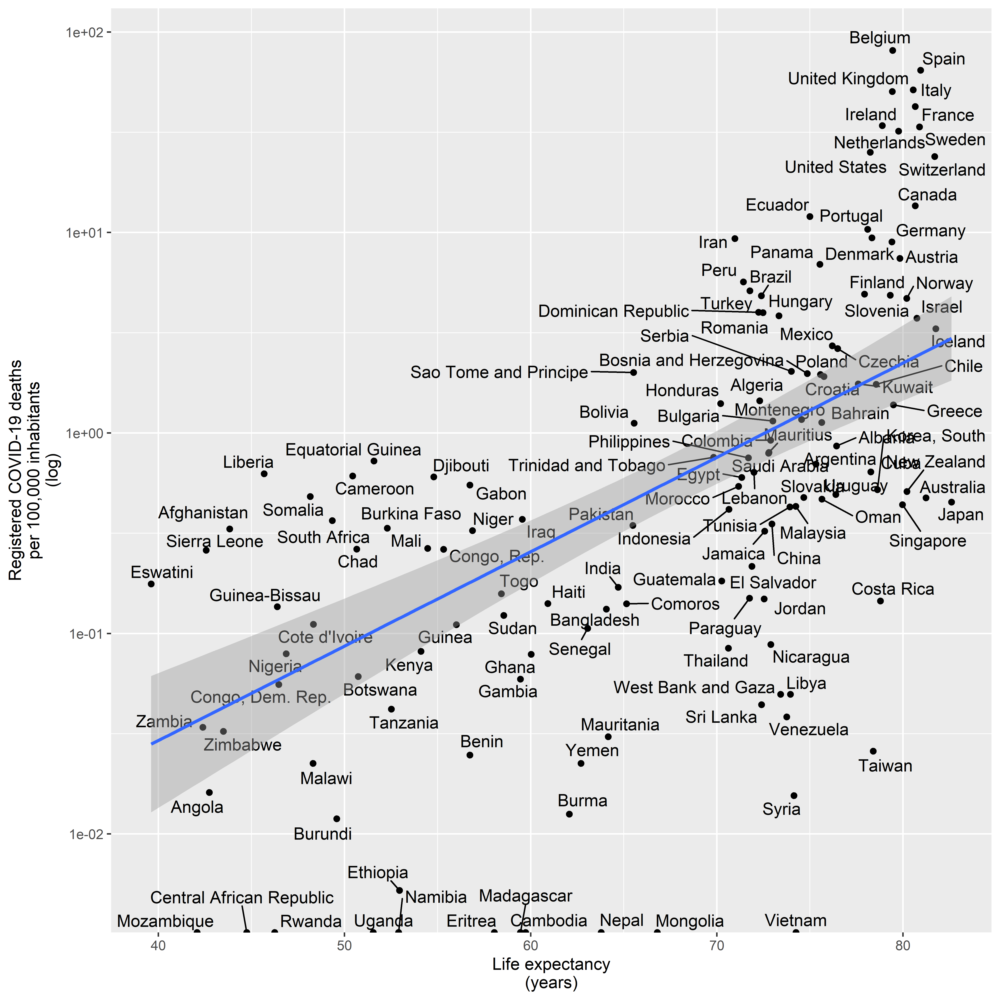
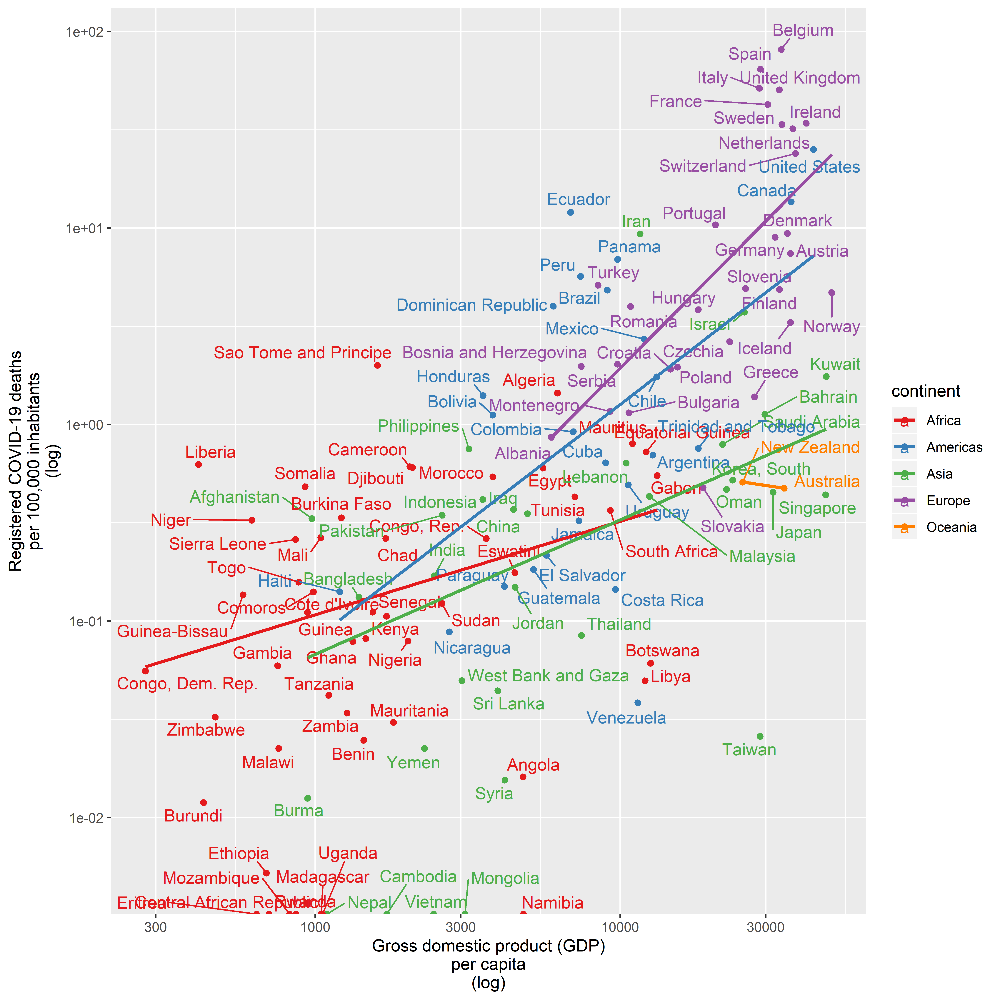

Registered COVID-19 Deaths by Country
================
Tommi Suvitaival, <tommi.raimo.leo.suvitaival@regionh.dk>, Steno
Diabetes Center Copenhagen
2020-05-14

# Introduction

  - Country data from gapminder R-package
  - COVID-19 data from coronavirus R-package (dev)

# Load Packages

``` r
library( magrittr )

# devtools::install_github( "covid19r/coronavirus")
```

# Prepare Data

## Gapminder

``` r
# View( gapminder::gapminder )

data.gm <-
  by(
    data = gapminder::gapminder,
    INDICES = gapminder::gapminder$"country",
    FUN =
      function( x ) {
        unlist( x[ which.max( x$"year" ), ] )
      }
  )

data.gm <-
  simplify2array(
    x = data.gm,
    higher = FALSE
  )

data.gm <- t( data.gm )

data.gm[ , "country" ] <- rownames( data.gm )

data.gm <-
  data.frame(
    data.gm,
    stringsAsFactors = FALSE
  )

data.gm[ , -1 ] <-
  apply(
    X = data.gm[ , -1 ],
    MAR = 2,
    FUN = as.numeric
  )

data.gm$"continent" <-
  factor(
    x = data.gm$"continent",
    levels = 1:5,
    labels = c( "Africa", "Americas", "Asia", "Europe", "Oceania" )
  )
```

## Coronavirus

``` r
data.covid <- 
  coronavirus::coronavirus %>%
  dplyr::group_by(
    Country.Region,
    type
  )  %>%
  dplyr::summarise(
    Deaths = sum( cases )
  )

data.covid$"Country.Region"[ data.covid$"Country.Region" == "US" ] <-
  "United States"
```

## Integrate

``` r
data <-
  merge(
    x = data.gm,
    y = data.covid[ which( data.covid$"type" == "death" ), ],
    by.x = "country",
    by.y = "Country.Region",
    all = FALSE
  )

data$"Deaths_per_Capita" <- data$"Deaths" / data$"pop"

data$"Deaths_per_100k" <- data$"Deaths_per_Capita" * 100000
```

# Figures

## Deaths vs. Population Size

### All

``` r
ggplot2::ggplot(
  data = data,
  mapping =
    ggplot2::aes(
      x = pop,
      y = Deaths,
      label = country
    )
) +
  ggplot2::geom_point() +
  ggplot2::scale_x_log10() +
  ggplot2::scale_y_log10() +
  ggrepel::geom_text_repel() +
  ggplot2::geom_smooth( method = "lm" ) +
  ggplot2::ylab( label = "Registered COVID-19 deaths\n(log)" ) +
  ggplot2::xlab( label = "Population size\n(log)" )
```

<!-- -->

``` r
summary(
  lm(
    formula = Deaths ~ pop,
    data = data
  )
)
```

    ## 
    ## Call:
    ## lm(formula = Deaths ~ pop, data = data)
    ## 
    ## Residuals:
    ##    Min     1Q Median     3Q    Max 
    ## -10400  -1743  -1657  -1541  71143 
    ## 
    ## Coefficients:
    ##              Estimate Std. Error t value Pr(>|t|)  
    ## (Intercept) 1.628e+03  7.567e+02   2.152   0.0333 *
    ## pop         9.600e-06  4.686e-06   2.049   0.0426 *
    ## ---
    ## Signif. codes:  0 '***' 0.001 '**' 0.01 '*' 0.05 '.' 0.1 ' ' 1
    ## 
    ## Residual standard error: 8194 on 126 degrees of freedom
    ## Multiple R-squared:  0.03223,    Adjusted R-squared:  0.02455 
    ## F-statistic: 4.197 on 1 and 126 DF,  p-value: 0.04258

### By Continent

``` r
ggplot2::ggplot(
  data = data,
  mapping =
    ggplot2::aes(
      x = pop,
      y = Deaths,
      color = continent,
      label = country
    )
) +
  ggplot2::geom_point() +
  ggplot2::scale_x_log10() +
  ggplot2::scale_y_log10() +
  ggrepel::geom_text_repel() +
  ggplot2::geom_smooth( method = "lm" ) +
  ggplot2::scale_color_brewer( palette = "Set1" ) +
  ggplot2::facet_wrap( facets = ggplot2::vars( continent ) ) +
  ggplot2::theme(
    legend.position = "none"
  ) +
  ggplot2::ylab( label = "Registered COVID-19 deaths\n(log)" ) +
  ggplot2::xlab( label = "Population size\n(log)" )
```

<!-- -->

## Deaths per Capita vs. Life Expectancy

### All

``` r
ggplot2::ggplot(
  data = data,
  mapping =
    ggplot2::aes(
      x = lifeExp,
      y = Deaths_per_100k,
      label = country
    )
) +
  ggplot2::geom_point() +
  ggplot2::scale_y_log10() +
  ggrepel::geom_text_repel() +
  ggplot2::geom_smooth( method = "lm" ) +
  ggplot2::ylab( label = "Registered COVID-19 deaths\nper 100,000 inhabitants\n(log)" ) +
  ggplot2::xlab( label = "Life expectancy\n(years)" )
```

<!-- -->

``` r
summary(
  lm(
    formula = Deaths_per_100k ~ lifeExp,
    data = data
  )
)
```

    ## 
    ## Call:
    ## lm(formula = Deaths_per_100k ~ lifeExp, data = data)
    ## 
    ## Residuals:
    ##     Min      1Q  Median      3Q     Max 
    ## -10.475  -6.253  -2.868   1.839  71.301 
    ## 
    ## Coefficients:
    ##              Estimate Std. Error t value Pr(>|t|)    
    ## (Intercept) -21.84710    6.05001  -3.611 0.000439 ***
    ## lifeExp       0.39678    0.08876   4.470 1.72e-05 ***
    ## ---
    ## Signif. codes:  0 '***' 0.001 '**' 0.01 '*' 0.05 '.' 0.1 ' ' 1
    ## 
    ## Residual standard error: 11.82 on 126 degrees of freedom
    ## Multiple R-squared:  0.1369, Adjusted R-squared:   0.13 
    ## F-statistic: 19.98 on 1 and 126 DF,  p-value: 1.721e-05

### By Continent

``` r
ggplot2::ggplot(
  data = data,
  mapping =
    ggplot2::aes(
      x = lifeExp,
      y = Deaths_per_100k,
      color = continent,
      label = country
    )
) +
  ggplot2::geom_point() +
  ggplot2::scale_y_log10() +
  ggrepel::geom_text_repel() +
  ggplot2::geom_smooth( method = "lm", se = FALSE ) +
  ggplot2::theme(
    legend.position = "none"
  ) +
  ggplot2::scale_color_brewer( palette = "Set1" ) +
  ggplot2::ylab( label = "Registered COVID-19 deaths\nper 100,000 inhabitants\n(log)" ) +
  ggplot2::xlab( label = "Life expectancy\n(years)" )
```

<!-- -->

## Deaths per Capita vs. Gross Domestic Product per Capita

### All

``` r
ggplot2::ggplot(
  data = data,
  mapping =
    ggplot2::aes(
      x = gdpPercap,
      y = Deaths_per_100k,
      label = country
    )
) +
  ggplot2::geom_point() +
  ggplot2::scale_x_log10() +
  ggplot2::scale_y_log10() +
  ggrepel::geom_text_repel() +
  ggplot2::geom_smooth( method = "lm" ) +
  ggplot2::ylab( label = "Registered COVID-19 deaths\nper 100,000 inhabitants\n(log)" ) +
  ggplot2::xlab( label = "Gross domestic product (GDP)\nper capita\n(log)" )
```

<!-- -->

``` r
data.model <- data

data.model$"Deaths_per_100k_log" <- log10( data.model$"Deaths_per_100k" )

data.model$"gdpPercap_log" <- log10( data.model$"gdpPercap" )

data.model <- data.model[ !is.infinite( data.model$"Deaths_per_100k_log" ), ]

summary(
  lm(
    formula = Deaths_per_100k_log ~ gdpPercap_log,
    data = data.model
  )
)
```

    ## 
    ## Call:
    ## lm(formula = Deaths_per_100k_log ~ gdpPercap_log, data = data.model)
    ## 
    ## Residuals:
    ##      Min       1Q   Median       3Q      Max 
    ## -1.53462 -0.44811  0.02877  0.47057  1.29105 
    ## 
    ## Coefficients:
    ##               Estimate Std. Error t value Pr(>|t|)    
    ## (Intercept)    -4.4256     0.4073  -10.87   <2e-16 ***
    ## gdpPercap_log   1.1199     0.1061   10.56   <2e-16 ***
    ## ---
    ## Signif. codes:  0 '***' 0.001 '**' 0.01 '*' 0.05 '.' 0.1 ' ' 1
    ## 
    ## Residual standard error: 0.6528 on 115 degrees of freedom
    ## Multiple R-squared:  0.4922, Adjusted R-squared:  0.4878 
    ## F-statistic: 111.5 on 1 and 115 DF,  p-value: < 2.2e-16

``` r
summary(
  lm(
    formula = Deaths_per_100k_log ~ gdpPercap_log + lifeExp,
    data = data.model
  )
)
```

    ## 
    ## Call:
    ## lm(formula = Deaths_per_100k_log ~ gdpPercap_log + lifeExp, data = data.model)
    ## 
    ## Residuals:
    ##     Min      1Q  Median      3Q     Max 
    ## -1.5508 -0.4156  0.0075  0.5034  1.3289 
    ## 
    ## Coefficients:
    ##                Estimate Std. Error t value Pr(>|t|)    
    ## (Intercept)   -4.496847   0.409399 -10.984  < 2e-16 ***
    ## gdpPercap_log  0.921127   0.182358   5.051 1.68e-06 ***
    ## lifeExp        0.012119   0.009062   1.337    0.184    
    ## ---
    ## Signif. codes:  0 '***' 0.001 '**' 0.01 '*' 0.05 '.' 0.1 ' ' 1
    ## 
    ## Residual standard error: 0.6506 on 114 degrees of freedom
    ## Multiple R-squared:  0.5001, Adjusted R-squared:  0.4913 
    ## F-statistic: 57.01 on 2 and 114 DF,  p-value: < 2.2e-16

``` r
ggplot2::ggplot(
  data = data,
  mapping =
    ggplot2::aes(
      x = gdpPercap,
      y = Deaths_per_100k,
      label = country
    )
) +
  ggplot2::geom_smooth( method = "lm" ) +
  ggplot2::geom_point(
    mapping = ggplot2::aes( color = continent )
  ) +
  ggplot2::scale_x_log10() +
  ggplot2::scale_y_log10() +
  ggrepel::geom_text_repel(
    mapping = ggplot2::aes( color = continent )
  ) +
  ggplot2::scale_color_brewer( palette = "Set1" ) +
  ggplot2::ylab( label = "Registered COVID-19 deaths\nper 100,000 inhabitants\n(log)" ) +
  ggplot2::xlab( label = "Gross domestic product (GDP)\nper capita\n(log)" )
```

<!-- -->

### By Continent

``` r
ggplot2::ggplot(
  data = data,
  mapping =
    ggplot2::aes(
      x = gdpPercap,
      y = Deaths_per_100k,
      color = continent,
      label = country
    )
) +
  ggplot2::geom_point() +
  ggplot2::scale_x_log10() +
  ggplot2::scale_y_log10() +
  ggrepel::geom_text_repel() +
  ggplot2::geom_smooth( method = "lm", se = FALSE ) +
  ggplot2::scale_color_brewer( palette = "Set1" ) +
  ggplot2::ylab( label = "Registered COVID-19 deaths\nper 100,000 inhabitants\n(log)" ) +
  ggplot2::xlab( label = "Gross domestic product (GDP)\nper capita\n(log)" )
```

<!-- -->

# Appendix

``` r
utils::sessionInfo()
```

    ## R version 3.6.2 (2019-12-12)
    ## Platform: x86_64-w64-mingw32/x64 (64-bit)
    ## Running under: Windows 10 x64 (build 17763)
    ## 
    ## Matrix products: default
    ## 
    ## locale:
    ## [1] LC_COLLATE=English_United States.1252 
    ## [2] LC_CTYPE=English_United States.1252   
    ## [3] LC_MONETARY=English_United States.1252
    ## [4] LC_NUMERIC=C                          
    ## [5] LC_TIME=English_United States.1252    
    ## 
    ## attached base packages:
    ## [1] stats     graphics  grDevices utils     datasets  methods   base     
    ## 
    ## other attached packages:
    ## [1] magrittr_1.5
    ## 
    ## loaded via a namespace (and not attached):
    ##  [1] Rcpp_1.0.3         knitr_1.27         munsell_0.5.0      tidyselect_1.0.0  
    ##  [5] colorspace_1.4-1   R6_2.4.1           rlang_0.4.6        stringr_1.4.0     
    ##  [9] dplyr_0.8.3        tools_3.6.2        grid_3.6.2         gtable_0.3.0      
    ## [13] xfun_0.12          htmltools_0.4.0    ellipsis_0.3.0     coronavirus_0.2.0 
    ## [17] lazyeval_0.2.2     yaml_2.2.0         digest_0.6.23      assertthat_0.2.1  
    ## [21] tibble_3.0.1       lifecycle_0.2.0    crayon_1.3.4       RColorBrewer_1.1-2
    ## [25] farver_2.0.3       ggplot2_3.2.1      purrr_0.3.3        gapminder_0.3.0   
    ## [29] vctrs_0.2.4        ggrepel_0.8.1      glue_1.3.1         evaluate_0.14     
    ## [33] rmarkdown_2.1      labeling_0.3       stringi_1.4.4      compiler_3.6.2    
    ## [37] pillar_1.4.3       scales_1.1.0       pkgconfig_2.0.3
