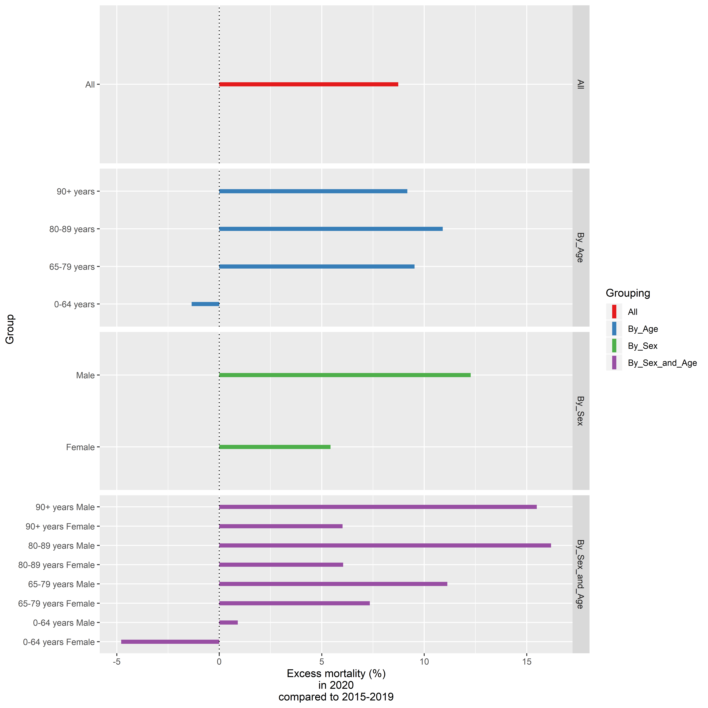
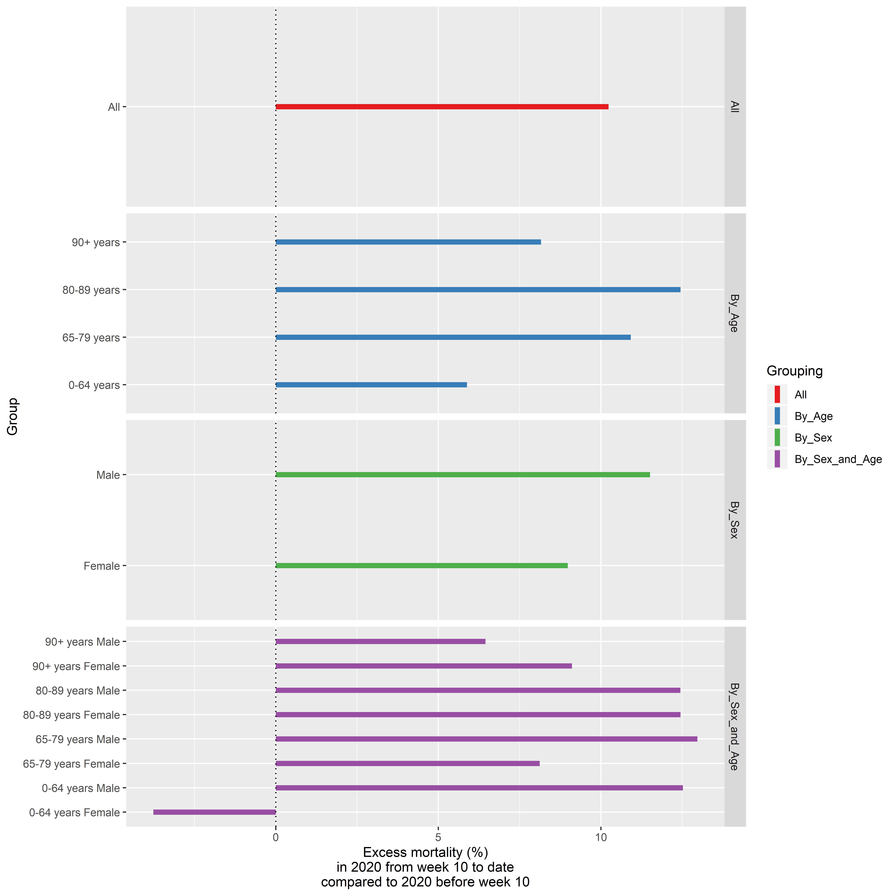

Mortality in Sweden
================
Tommi Suvitaival, <tommi.raimo.leo.suvitaival@regionh.dk>, Steno
Diabetes Center Copenhagen
2020-07-10

# Updates

  - Calculations updated to new data from 3.7.2020.

# Load Data

  - Data from Statistics Sweden SCB:
      - Överdödligheten sjunker i
        Sverige
      - <https://www.scb.se/om-scb/nyheter-och-pressmeddelanden/overdodligheten-sjunker-i-sverige/>
      - Preliminär statistik över döda
        (excelfil)
      - <https://www.scb.se/hitta-statistik/statistik-efter-amne/befolkning/befolkningens-sammansattning/befolkningsstatistik/pong/tabell-och-diagram/preliminar-statistik-over-doda/>

<!-- end list -->

``` r
data.loaded <-
  readxl::read_excel(
    path = "H:/projects/covid19/data/SCB/2020-07-03-preliminar_statistik_over_doda_inkl_eng_ver2.xlsx",
    # path = "H:/projects/covid19/data/SCB/2020-05-08---preliminar-statistik-over-doda-inkl-eng.xlsx",
    sheet = "Tabell 7",
    skip = 8
  )
```

    ## New names:
    ## * `M 0-64 år` -> `M 0-64 år...3`
    ## * `M 65-79 år` -> `M 65-79 år...4`
    ## * `M 80-89 år` -> `M 80-89 år...5`
    ## * `M 90+ år` -> `M 90+ år...6`
    ## * `K 0-64 år` -> `K 0-64 år...7`
    ## * ...

# Prepare Data

## Add Unassigned Deaths to Total

``` r
data <- data.loaded

data[ data == 0 ] <- NA

tmp <- which( data$"Vecka" == "Uppgift saknas" ) 

idx.data <- 2:19

data.before.adding <- data

for ( i in 1:length( idx.data ) ) {
  
  idx.obs.i <- which( !is.na( data[ -tmp, idx.data[ i ] ] ) )
  
  data[ idx.obs.i, idx.data[ i ] ] <- 
    data[ idx.obs.i, idx.data[ i ] ] +
    unlist( data[ tmp, idx.data[ i ] ] ) / length( idx.obs.i )
  
}
```

## Bind Periods

``` r
tmp <- data.loaded

colnames( tmp ) <-
  stringr::str_replace(
    string = colnames( tmp ),
    pattern = "\\.\\.\\.[0-9]+$",
    replacement = ""
  )

data <- tmp[ , 1:10 ]

data$"Period" <- colnames( data )[ 2 ]

colnames( data )[ 2 ] <- "Total"

tmp <- tmp[ , c( 1, 11:19 ) ]

tmp$"Period" <- colnames( tmp )[ 2 ]

colnames( tmp )[ 2 ] <- "Total"

tmp[ tmp == 0 ] <- NA

data <-
  dplyr::bind_rows(
    data,
    tmp
  )

tmp <- data

data <- data[ , -c( 2, 7:10 ) ]

colnames( data ) <-
  stringr::str_replace(
    string = colnames( data ),
    pattern = "^M ",
    replacement = ""
  )

tmp <- tmp[ , -( 2:6 ) ]

colnames( tmp ) <-
  stringr::str_replace(
    string = colnames( tmp ),
    pattern = "^K ",
    replacement = ""
  )

data <-
  dplyr::bind_rows(
    Male = data,
    Female = tmp,
    .id = "Sex"
  )

data$"Period" <-
  relevel(
    x = as.factor( data$"Period" ),
    ref = "2020"
  )
```

## Translate

``` r
colnames( data )[ colnames( data ) == "Vecka" ] <- "Week"

colnames( data ) <-
  stringr::str_replace(
    string = colnames( data ),
    pattern = "år",
    replacement = "years"
  )
```

## Pivot to Longer Format

``` r
data.plot <- data

data.plot$"Week" <- as.numeric( data.plot$"Week" )

data.plot <- data.plot[ !is.na( data.plot$"Week" ), ]

data.plot <-
  tidyr::pivot_longer(
    data = data.plot,
    cols =
      colnames( data.plot )[
        grep(
          x = colnames( data.plot ),
          pattern = "(Total)|(years)"
        )
        ],
    names_to = "Age",
    values_to = "Deaths"
  )
```

## Omit Incomplete Weeks

``` r
data.plot <-
  dplyr::filter(
    .data = data.plot,
    Week != 1 &
      Week < 51
  )

tmp <- 
  data.plot$"Period" == levels( data.plot$"Period" )[ 1 ] &
  !is.na( data.plot$"Deaths" )

tmp <- data.plot[ tmp, "Week" ]

tmp <- max( unlist( tmp ) )

data.plot <-
  dplyr::filter(
    .data = data.plot,
    # Week < tmp - 1 |
    Week < tmp |
      Period != levels( data.plot$"Period" )[ 1 ]
  )
```

# Plot

## By Sex

``` r
ggplot2::ggplot(
  data = data.plot,
  mapping =
    ggplot2::aes(
      x = Week,
      y = Deaths,
      color = Age,
      linetype = Period,
      shape = Period
    )
) +
  ggplot2::geom_point( alpha = 0.75 ) +
  ggplot2::geom_smooth() +
  ggplot2::scale_y_log10() +
  ggplot2::facet_grid(
    col = ggplot2::vars( Sex )
  ) +
  ggplot2::scale_color_brewer(
    palette = "Set1",
    direction = -1
  ) +
  ggplot2::theme(
    legend.position = "top",
    legend.direction = "vertical"
  )
```

    ## `geom_smooth()` using method = 'loess' and formula 'y ~ x'

<!-- -->

## By Age Groups

``` r
ggplot2::ggplot(
  data = data.plot,
  mapping =
    ggplot2::aes(
      x = Week,
      y = Deaths,
      color = Period,
      linetype = Sex,
      shape = Sex
    )
) +
  ggplot2::geom_point( alpha = 0.75 ) +
  ggplot2::geom_smooth() +
  ggplot2::scale_y_log10() +
  ggplot2::facet_wrap(
    facets = ggplot2::vars( Age )
  ) +
  ggplot2::scale_color_brewer(
    palette = "Set1"
    # ,
    # direction = -1
  )
```

    ## `geom_smooth()` using method = 'loess' and formula 'y ~ x'

<!-- -->

## By Age Groups and Sex

``` r
ggplot2::ggplot(
  data = data.plot,
  mapping =
    ggplot2::aes(
      x = Week,
      y = Deaths,
      color = Period,
      linetype = Period,
      shape = Period
    )
) +
  ggplot2::geom_point( alpha = 0.75 ) +
  ggplot2::geom_smooth() +
  ggplot2::scale_y_log10() +
  ggplot2::facet_grid(
    cols = ggplot2::vars( Sex ),
    rows = ggplot2::vars( Age ),
    scales = "free_y"
  ) +
  ggplot2::scale_color_brewer(
    palette = "Set1"
    # ,
    # direction = -1
  )
```

    ## `geom_smooth()` using method = 'loess' and formula 'y ~ x'

<!-- -->

``` r
ggplot2::ggplot(
  data = data.plot,
  mapping =
    ggplot2::aes(
      x = Week,
      y = Deaths,
      color = Period,
      linetype = Period,
      shape = Period
    )
) +
  ggplot2::geom_point( alpha = 0.75 ) +
  ggplot2::geom_smooth() +
  ggplot2::scale_y_log10() +
  ggplot2::facet_grid(
    rows = ggplot2::vars( Sex ),
    cols = ggplot2::vars( Age )
  ) +
  ggplot2::scale_color_brewer(
    palette = "Set1"
  ) +
  ggplot2::theme(
    legend.position = "top"
  )
```

    ## `geom_smooth()` using method = 'loess' and formula 'y ~ x'

<!-- -->

# Excess Mortality

## Year 2020 to Date Compared to the Same Weeks in 2015-2019

``` r
weeks.2020 <- 
  sort( unique( data.plot$"Week"[ which( data.plot$"Period" == "2020" ) ] ) )

tmp <- which( data.plot$"Week" %in% weeks.2020 )

difference <-
  by(
    data = data.plot[ tmp, ],
    INDICES = paste( data.plot$"Sex", data.plot$"Age", data.plot$"Week" )[ tmp ],
    FUN = 
      function( x ) {
        
        tmp <- 
          unlist(
            x$"Deaths"[ x$"Period" == "2020" ] - 
              x$"Deaths"[ x$"Period" != "2020" ]
          )
        y <-
          data.frame(
            x,
            Increase_in_Deaths = NA,
            Increase_in_Deaths_Pcnt = NA
          )
        y$"Increase_in_Deaths"[ y$"Period" == "2020" ] <- tmp
        y$"Increase_in_Deaths_Pcnt"[ y$"Period" == "2020" ] <-
          tmp / x$"Deaths"[ x$"Period" != "2020" ] * 100
        
        return( y )
        
      }
  )

difference <-
  dplyr::bind_rows(
    difference,
    .id = "Sex_Age_Week"
  )

difference$"Increase_in_Deaths_per_Week" <-
  difference$"Increase_in_Deaths" / length( weeks.2020 )
```

``` r
# ggplot2::ggplot(
#   data = difference,
#   mapping =
#     ggplot2::aes(
#       x = Week,
#       y = Increase_in_Deaths_Pcnt,
#       shape = Sex,
#       color = Age,
#       linetype = Sex
#     )
# ) +
#   ggplot2::geom_point() +
#   ggplot2::geom_smooth( se = FALSE ) +
#   ggplot2::scale_color_brewer(
#     palette = "Set1",
#     direction = -1
#   ) +
#   ggplot2::ylab(
#     label = "Excess mortality (%)\nin 2020\ncompared to same week in 2015-2019"
#   ) +
#   ggplot2::theme(
#     legend.position = "top",
#     legend.direction = "vertical"
#   )
```

``` r
ggplot2::ggplot(
  data = difference,
  mapping =
    ggplot2::aes(
      x = Week,
      y = Increase_in_Deaths_Pcnt,
      shape = Sex,
      color = Sex
    )
) +
  ggplot2::geom_point() +
  ggplot2::geom_smooth() +
  ggplot2::geom_hline(
    yintercept = 0,
    linetype = "dashed"
  ) +
  ggplot2::facet_wrap( facets = ggplot2::vars( Age ) ) +
  ggplot2::scale_color_brewer( palette = "Set1" ) +
  ggplot2::ylab(
    label = "Excess mortality (%)\nin 2020\ncompared to same week in 2015-2019"
  )
```

<!-- -->

``` r
difference.by.age.and.sex <-
  by(
    data = difference,
    INDICES = paste( difference$"Age", difference$"Sex" ),
    FUN =
      function( x ) {
        tmp <- which( x$"Period" == "2020" )
        tmp2 <- sum( x$"Deaths"[ tmp ] ) - sum( x$"Deaths"[ -tmp ] )
        c(
          Increase_in_Deaths = tmp2,
          Increase_in_Deaths_Pcnt = tmp2 / sum( x$"Deaths"[ -tmp ] ) * 100
        )
      }
  )

difference.by.age.and.sex <- t( simplify2array( x = difference.by.age.and.sex ) )

difference.by.sex <-
  by(
    data = difference,
    INDICES = difference$"Sex",
    FUN =
      function( x ) {
        tmp <- which( x$"Period" == "2020" )
        tmp2 <- sum( x$"Deaths"[ tmp ] ) - sum( x$"Deaths"[ -tmp ] )
        c(
          Increase_in_Deaths = tmp2,
          Increase_in_Deaths_Pcnt = tmp2 / sum( x$"Deaths"[ -tmp ] ) * 100
        )
      }
  )

difference.by.sex <- t( simplify2array( x = difference.by.sex ) )

difference.by.age <-
  by(
    data = difference,
    INDICES = difference$"Age",
    FUN =
      function( x ) {
        tmp <- which( x$"Period" == "2020" )
        tmp2 <- sum( x$"Deaths"[ tmp ] ) - sum( x$"Deaths"[ -tmp ] )
        c(
          Increase_in_Deaths = tmp2,
          Increase_in_Deaths_Pcnt = tmp2 / sum( x$"Deaths"[ -tmp ] ) * 100
        )
      }
  )

difference.by.age <- 
  t( simplify2array( x = difference.by.age ) )

tmp <- 
  sum( difference$"Deaths"[ difference$"Period" == "2020" ] ) -
  sum( difference$"Deaths"[ difference$"Period" != "2020" ] )

difference.year.all <- 
  c(
    Increase_in_Deaths = tmp,
    Increase_in_Deaths_Pcnt = 
      tmp / sum( difference$"Deaths"[ difference$"Period" != "2020" ] ) * 100
  )

difference.by.group <-
  dplyr::bind_rows(
    By_Sex_and_Age = 
      data.frame(
        Group = rownames( difference.by.age.and.sex ),
        difference.by.age.and.sex
      ),
    By_Sex = 
      data.frame(
        Group = rownames( difference.by.sex ),
        difference.by.sex
      ),
    By_Age = 
      data.frame(
        Group = rownames( difference.by.age ),
        difference.by.age
        ),
    All =
      data.frame(
        Group = "All",
        t( difference.year.all )
        ),
    .id = "Grouping"
  )

difference.by.group$"Increase_in_Deaths_per_Week" <-
  difference.by.group$"Increase_in_Deaths" / length( weeks.2020 )
```

``` r
ggplot2::ggplot(
  data = difference.by.group,
  mapping =
    ggplot2::aes(
      x = Group,
      ymax = Increase_in_Deaths_Pcnt,
      ymin = 0,
      color = Grouping
    ),
) +
  ggplot2::geom_linerange( size = 2 ) +
  ggplot2::geom_hline( yintercept = 0, linetype = "dotted" ) +
  ggplot2::coord_flip() +
  ggplot2::facet_grid(
    rows = ggplot2::vars( Grouping ),
    scales = "free_y"
  ) +
  ggplot2::scale_color_brewer( palette = "Set1" ) +
  ggplot2::ylab(
    label = "Excess mortality (%)\nin 2020\ncompared to 2015-2019"
  )
```

<!-- -->

``` r
data.table <- difference.by.group[ , -c( 1, 3 ) ]

data.table$"Increase_in_Deaths_per_Week" <-
  round( data.table$"Increase_in_Deaths_per_Week" )

data.table$"Increase_in_Deaths_Pcnt" <- 
  round( data.table$"Increase_in_Deaths_Pcnt" )

# print(
#   knitr::kable(
#     x = data.table
#   )
# )
```

## Year 2020 from Week 10 to Date Compared to Before Week 10

``` r
tmp <- which( data.plot$"Period" == "2020" )

data.prepost <- data.plot[ tmp, ]

difference.prepost <-
  by(
    data = data.prepost,
    INDICES = paste( data.prepost$"Age", data.prepost$"Sex" ),
    FUN =
      function( x ) {
        tmp <- which( x$"Week" > 9 )
        # tmp <- which( x$"Period" == "2020" )
        tmp2 <- mean( x$"Deaths"[ tmp ] ) - mean( x$"Deaths"[ -tmp ] )
        c(
          Increase_in_Deaths_per_Week = tmp2,
          Increase_in_Deaths_per_Week_Pcnt = tmp2 / mean( x$"Deaths"[ -tmp ] ) * 100
        )
      }
  )

difference.prepost <- t( simplify2array( x = difference.prepost ) )

difference.prepost.by.sex <-
  by(
    data = data.prepost,
    INDICES = data.prepost$"Sex",
    FUN =
      function( x ) {
        tmp <- which( x$"Week" > 9 )
        tmp2 <- mean( x$"Deaths"[ tmp ] ) - mean( x$"Deaths"[ -tmp ] )
        c(
          Increase_in_Deaths_per_Week = tmp2,
          Increase_in_Deaths_per_Week_Pcnt = tmp2 / mean( x$"Deaths"[ -tmp ] ) * 100
        )
      }
  )

difference.prepost.by.sex <- 
  t( simplify2array( x = difference.prepost.by.sex ) )

difference.prepost.by.age <-
  by(
    data = data.prepost,
    INDICES = data.prepost$"Age",
    FUN =
      function( x ) {
        tmp <- which( x$"Week" > 9 )
        tmp2 <- mean( x$"Deaths"[ tmp ] ) - mean( x$"Deaths"[ -tmp ] )
        c(
          Increase_in_Deaths_per_Week = tmp2,
          Increase_in_Deaths_per_Week_Pcnt = 
            tmp2 / mean( x$"Deaths"[ -tmp ] ) * 100
        )
      }
  )

difference.prepost.by.age <- 
  t( simplify2array( x = difference.prepost.by.age ) )

tmp <- 
  mean( data.prepost$"Deaths"[ data.prepost$"Week" > 9 ] ) -
  mean( data.prepost$"Deaths"[ data.prepost$"Week" <= 9 ] )

difference.prepost.all <- 
  c(
    Increase_in_Deaths_per_Week = tmp,
    Increase_in_Deaths_per_Week_Pcnt = 
      tmp / mean( data.prepost$"Deaths"[ data.prepost$"Week" <= 9 ] ) * 100
  )

difference.prepost.by.group <-
  dplyr::bind_rows(
    By_Sex_and_Age = 
      data.frame(
        Group = rownames( difference.prepost ),
        difference.prepost
      ),
    By_Sex = 
      data.frame(
        Group = rownames( difference.prepost.by.sex ),
        difference.prepost.by.sex
      ),
    By_Age = 
      data.frame(
        Group = rownames( difference.prepost.by.age ),
        difference.prepost.by.age
        ),
    All =
      data.frame(
        Group = "All",
        t( difference.prepost.all )
        ),
    .id = "Grouping"
  )
```

``` r
ggplot2::ggplot(
  data = difference.prepost.by.group,
  mapping =
    ggplot2::aes(
      x = Group,
      ymax = Increase_in_Deaths_per_Week_Pcnt,
      ymin = 0,
      color = Grouping
    ),
) +
  ggplot2::geom_linerange( size = 2 ) +
  ggplot2::geom_hline( yintercept = 0, linetype = "dotted" ) +
  ggplot2::coord_flip() +
  ggplot2::facet_grid(
    rows = ggplot2::vars( Grouping ),
    scales = "free_y"
  ) +
  ggplot2::ylab(
    label = "Excess mortality (%)\nin 2020 from week 10 to date\ncompared to 2020 before week 10"
  ) +
  ggplot2::scale_color_brewer( palette = "Set1" )
```

<!-- -->

``` r
data.table <- difference.prepost.by.group[ , -1 ]

data.table$"Increase_in_Deaths_per_Week" <- 
  round( data.table$"Increase_in_Deaths_per_Week" )

data.table$"Increase_in_Deaths_per_Week_Pcnt" <- 
  round( data.table$"Increase_in_Deaths_per_Week_Pcnt" )

# knitr::kable(
#   x = data.table
# )
```

## At Peak Week Compared to the Same Week in 2015-2019

``` r
tmp <-
  tapply(
    X = data.plot$"Deaths"[ data.plot$"Period" == 2020 ],
    INDEX = data.plot$"Week"[ data.plot$"Period" == 2020 ],
    FUN =
      function( x ) {
        sum( x )
      }
  )

week.peak <- as.numeric( names( which.max( tmp ) ) )

data.peak <- data.plot[ data.plot$"Week" == week.peak, ]

difference.peak <-
  by(
    data = data.peak,
    INDICES = paste( data.peak$"Age", data.peak$"Sex" ),
    FUN =
      function( x ) {
        tmp <- which( x$"Period" == "2020" )
        tmp2 <- x$"Deaths"[ tmp ] - x$"Deaths"[ -tmp ]
        c(
          Increase_in_Deaths = tmp2,
          Increase_in_Deaths_Pcnt = tmp2 / x$"Deaths"[ -tmp ] * 100
        )
      }
  )

difference.peak <- t( simplify2array( x = difference.peak ) )
```

``` r
difference.peak.by.sex <-
  by(
    data = data.peak,
    INDICES = data.peak$"Sex",
    FUN =
      function( x ) {
        tmp <- which( x$"Period" == "2020" )
        tmp2 <- sum( x$"Deaths"[ tmp ] ) - sum( x$"Deaths"[ -tmp ] )
        c(
          Increase_in_Deaths = tmp2,
          Increase_in_Deaths_Pcnt = tmp2 / sum( x$"Deaths"[ -tmp ] ) * 100
        )
      }
  )

difference.peak.by.sex <- t( simplify2array( x = difference.peak.by.sex ) )

difference.peak.by.age <-
  by(
    data = data.peak,
    INDICES = data.peak$"Age",
    FUN =
      function( x ) {
        tmp <- which( x$"Period" == "2020" )
        tmp2 <- sum( x$"Deaths"[ tmp ] ) - sum( x$"Deaths"[ -tmp ] )
        c(
          Increase_in_Deaths = tmp2,
          Increase_in_Deaths_Pcnt = tmp2 / sum( x$"Deaths"[ -tmp ] ) * 100
        )
      }
  )

difference.peak.by.age <- 
  t( simplify2array( x = difference.peak.by.age ) )

tmp <- 
  sum( data.peak$"Deaths"[ data.peak$"Period" == "2020" ] ) -
  sum( data.peak$"Deaths"[ data.peak$"Period" != "2020" ] )
```

``` r
difference.peak.all <- 
  c(
    Increase_in_Deaths = tmp,
    Increase_in_Deaths_Pcnt = 
      tmp / sum( data.peak$"Deaths"[ data.peak$"Period" == "2020" ] ) * 100
  )

difference.peak.by.group <-
  dplyr::bind_rows(
    By_Sex_and_Age = 
      data.frame(
        Group = rownames( difference.peak ),
        difference.peak
      ),
    By_Sex = 
      data.frame(
        Group = rownames( difference.peak.by.sex ),
        difference.peak.by.sex
      ),
    By_Age = 
      data.frame(
        Group = rownames( difference.peak.by.age ),
        difference.peak.by.age
        ),
    All =
      data.frame(
        Group = "All",
        t( difference.peak.all )
        ),
    .id = "Grouping"
  )

difference.peak.by.group$"Increase_in_Deaths_per_Week" <- 
  difference.peak.by.group$"Increase_in_Deaths"
```

``` r
# ggplot2::ggplot(
#   data = difference.peak.by.group,
#   mapping =
#     ggplot2::aes(
#       x = Group,
#       ymax = Increase_in_Deaths_Pcnt,
#       ymin = 0,
#       color = Grouping
#     ),
# ) +
#   ggplot2::geom_linerange( size = 2 ) +
#   ggplot2::geom_hline( yintercept = 0, linetype = "dotted" ) +
#   ggplot2::coord_flip() +
#   ggplot2::facet_grid(
#     rows = ggplot2::vars( Grouping ),
#     scales = "free_y"
#   ) +
#   ggplot2::ylab(
#     label = "Excess mortality (%)\nat peak week (15) in 2020\ncompared to the same week in 2015-2019"
#   ) +
#   ggplot2::scale_color_brewer( palette = "Set1" )
```

``` r
data.table <- difference.peak.by.group[ , -c( 1, 3 ) ]

data.table$"Increase_in_Deaths_per_Week" <- 
  round( data.table$"Increase_in_Deaths_per_Week" )

data.table$"Increase_in_Deaths_Pcnt" <- 
  round( data.table$"Increase_in_Deaths_Pcnt" )

# knitr::kable(
#   x = data.table
# )
```

# Appendix

``` r
utils::sessionInfo()
```

    ## R version 3.6.2 (2019-12-12)
    ## Platform: x86_64-w64-mingw32/x64 (64-bit)
    ## Running under: Windows 10 x64 (build 17763)
    ## 
    ## Matrix products: default
    ## 
    ## locale:
    ## [1] LC_COLLATE=English_United States.1252 
    ## [2] LC_CTYPE=English_United States.1252   
    ## [3] LC_MONETARY=English_United States.1252
    ## [4] LC_NUMERIC=C                          
    ## [5] LC_TIME=English_United States.1252    
    ## 
    ## attached base packages:
    ## [1] stats     graphics  grDevices utils     datasets  methods   base     
    ## 
    ## loaded via a namespace (and not attached):
    ##  [1] Rcpp_1.0.3         knitr_1.27         magrittr_1.5       munsell_0.5.0     
    ##  [5] tidyselect_1.0.0   colorspace_1.4-1   R6_2.4.1           rlang_0.4.6       
    ##  [9] plyr_1.8.5         stringr_1.4.0      dplyr_0.8.3        tools_3.6.2       
    ## [13] grid_3.6.2         gtable_0.3.0       xfun_0.12          htmltools_0.4.0   
    ## [17] ellipsis_0.3.0     lazyeval_0.2.2     yaml_2.2.0         readxl_1.3.1      
    ## [21] digest_0.6.23      assertthat_0.2.1   tibble_3.0.1       lifecycle_0.2.0   
    ## [25] crayon_1.3.4       farver_2.0.3       RColorBrewer_1.1-2 reshape2_1.4.3    
    ## [29] ggplot2_3.2.1      tidyr_1.0.0        purrr_0.3.3        vctrs_0.2.4       
    ## [33] glue_1.3.1         evaluate_0.14      rmarkdown_2.1      labeling_0.3      
    ## [37] stringi_1.4.4      compiler_3.6.2     pillar_1.4.3       cellranger_1.1.0  
    ## [41] scales_1.1.0       pkgconfig_2.0.3
