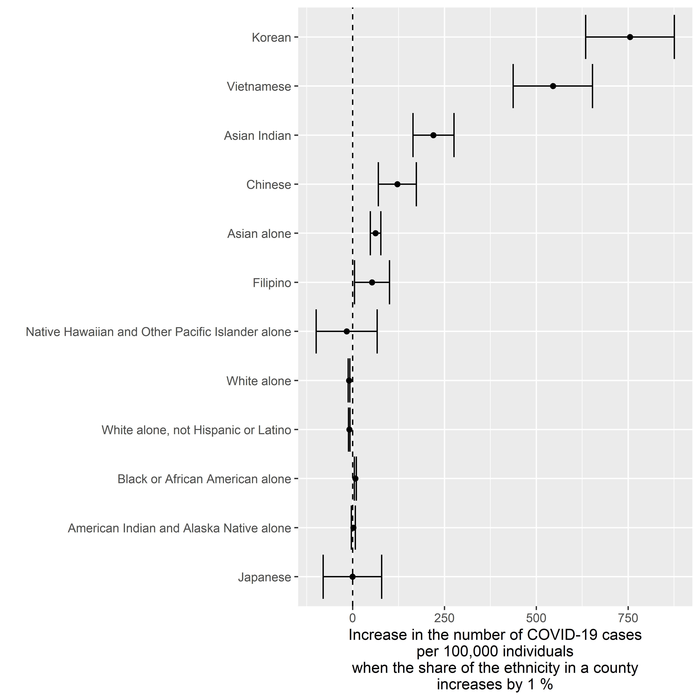
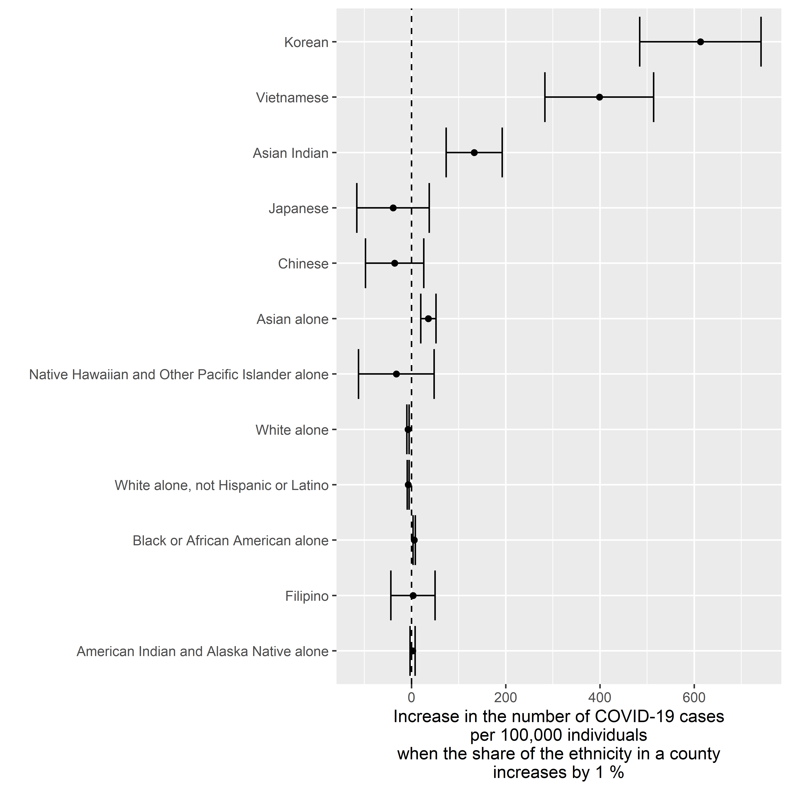
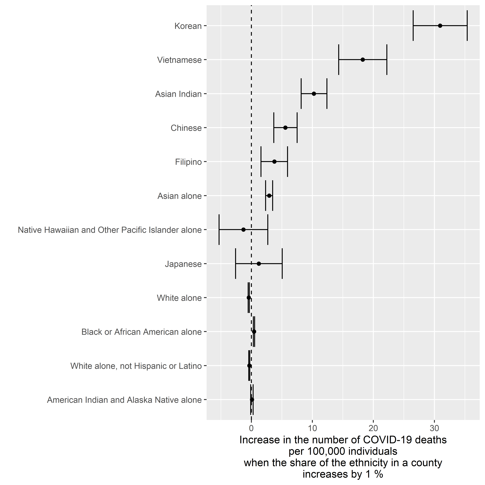
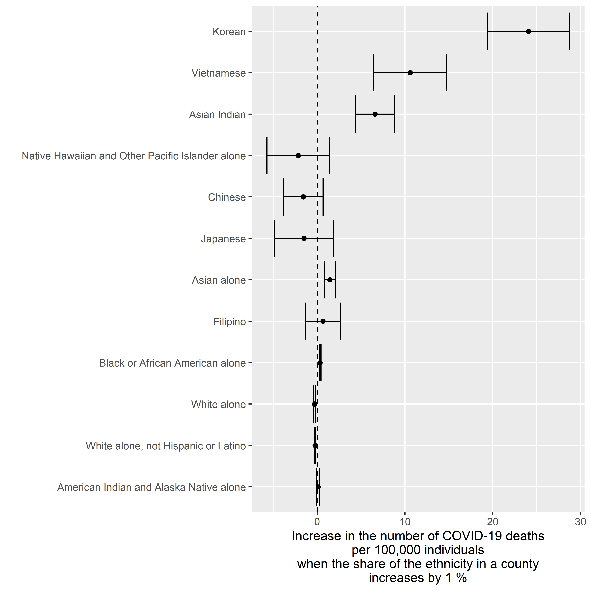

COVID-19 Cases by Ethnicity
================
Tommi Suvitaival, <tommi.raimo.leo.suvitaival@regionh.dk>, Steno
Diabetes Center Copenhagen
2020-05-19

# Introduction

  - County-level COVID-19 data from New York Times
  - County-level population data from US
Census

# Load Data

## Census

``` r
# Source: https://www2.census.gov/library/publications/2011/compendia/usa-counties/excel/POP01.xls",

N.sheets <- 10

data.census.loaded <-
  lapply(
    X = 1:N.sheets,
    FUN =
      function( x ) {
        readxl::read_excel(
          path = "H:/projects/covid19/data/US_Census/POP01.xls",
          sheet = x
        )
      }
  )

# Source: https://www2.census.gov/library/publications/2011/compendia/usa-counties/excel/Mastdata.xls

mastdata.census <-
  readxl::read_excel(
    path = "H:/projects/covid19/data/US_Census/Mastdata.xls",
  )


data.census <- data.census.loaded[[ 1 ]]

for ( i in 2:length( data.census.loaded ) ) {
  
  data.census <-
    merge(
      x = data.census,
      y = data.census.loaded[[ i ]][ , -1 ],
      by = "STCOU",
      all = TRUE
    )
  
}

tmp <-
  match(
    table = mastdata.census$"Item_Id",
    x = colnames( data.census )
  )

data.census.orig <- data.census

colnames( data.census )[ !is.na( tmp ) ] <-
  unlist( mastdata.census[ tmp[ !is.na( tmp ) ], "Item_Description" ] )
```

## COVID-19

``` r
data.covid.loaded <-
  readr::read_csv(
    file = "https://raw.githubusercontent.com/nytimes/covid-19-data/master/us-counties.csv"
  )
```

    ## Parsed with column specification:
    ## cols(
    ##   date = col_date(format = ""),
    ##   county = col_character(),
    ##   state = col_character(),
    ##   fips = col_character(),
    ##   cases = col_double(),
    ##   deaths = col_double()
    ## )

``` r
# View( data.covid.loaded )
```

``` r
data.covid <-
  by(
    data = data.covid.loaded,
    INDICES = data.covid.loaded$"fips",
    FUN =
      function( x ) {
        as.data.frame( x[ which.max( x$"date" ), ] )
      }
  )

data.covid <- dplyr::bind_rows( data.covid )

data.covid <-
  merge(
    x = data.covid,
    y = USAboundaries::state_codes,
    by.x = "state",
    by.y = "state_name",
    all.x = TRUE,
    all.y = FALSE
  )

data.covid$"County_State" <-
  paste(
    data.covid$"county",
    data.covid$"state_abbr",
    sep = ", "
  )
```

## Merge

``` r
data <-
  merge(
    x = data.covid,
    y = data.census,
    by.x = "County_State",
    by.y = "Area_name",
    all = FALSE
  )

data$"Deaths_per_Capita" <-
  data$"deaths" / data$"Resident population (April 1 - complete count) 2010"

data$"Deaths_per_100k" <- data$"Deaths_per_Capita" * 100000

data$"Cases_per_Capita" <-
  data$"cases" / data$"Resident population (April 1 - complete count) 2010"

data$"Cases_per_100k" <- data$"Cases_per_Capita" * 100000
```

## Compute Share of Population

``` r
names.tested <-
  colnames( data.census )[ nchar( colnames( data.census ) ) > 11 ]

names.tested <-
  names.tested[ 
    grep(
      x = names.tested,
      pattern = "2010"
    )
    ]

names.tested <-
  names.tested[
    !grepl(
      x = names.tested,
      pattern = "(change)|(percent)|(resident population)|(male)",
      ignore.case = TRUE
    )
  ]

data.test <- data

tmp <-
  grepl(
    x = names.tested,
    pattern = "(population of)|(alone population)",
    ignore.case = TRUE
  )

names.to.pcnt <- names.tested[ tmp ]

data.test[ , names.to.pcnt ] <-
  apply(
    X = data[ , names.to.pcnt ],
    MAR = 2,
    FUN =
      function( x ) {
        y <- 
          x / 
          data[ , "Resident population (April 1 - complete count) 2010" ] *
          100
        return( y )
      }
  )

names.mapping <-
  data.frame(
    Name.original = colnames( data.test ),
    Name.made = make.names( colnames( data.test ) ),
    stringsAsFactors = FALSE
  )

names.mapping$"Name.clean" <- names.mapping$"Name.original"
  
names.mapping$"Name.clean" <-
  stringr::str_replace(
    string = names.mapping$"Name.clean",
    pattern = "Population of one race \\- ",
    replacement = ""
  )

names.mapping$"Name.clean" <-
  stringr::str_replace(
    string = names.mapping$"Name.clean",
    pattern = " 2010 \\(complete count\\)",
    replacement = ""
  )

names.mapping$"Name.clean" <-
  stringr::str_replace(
    string = names.mapping$"Name.clean",
    pattern = "Asian alone population \\- ",
    replacement = ""
  )

rownames( names.mapping ) <- names.mapping$"Name.made"

colnames( data.test ) <- make.names( colnames( data.test ) )

data.test$"Population.per.square.mile.2010" <- 
  scale( data.test$"Population.per.square.mile.2010" )

names.tested <- make.names( names.tested )

names.tested <-
  names.tested[ names.tested != "Population.per.square.mile.2010" ]
```

# Cases v. Ethnicity

## Crude Model

``` r
result <- 
  purrr::map(
    .x = names.tested,
    .f =
      function( x ) {
        
        formula <- paste( "Cases_per_100k ~", x, "+ (1|state)", sep = "" )
        formula <- as.formula( formula )
        tmp <-
          lme4::lmer(
            formula = formula,
            data = data.test
          )
        
        return(
          data.frame(
            Name = x,
            Fixef = lme4::fixef( tmp )[ x ],
            lme4::confint.merMod( object = tmp, parm = x )
          )
        )
        
      }
  )
```

    ## Computing profile confidence intervals ...
    ## Computing profile confidence intervals ...
    ## Computing profile confidence intervals ...
    ## Computing profile confidence intervals ...
    ## Computing profile confidence intervals ...
    ## Computing profile confidence intervals ...
    ## Computing profile confidence intervals ...
    ## Computing profile confidence intervals ...
    ## Computing profile confidence intervals ...
    ## Computing profile confidence intervals ...
    ## Computing profile confidence intervals ...
    ## Computing profile confidence intervals ...

``` r
result.bound <- dplyr::bind_rows( result, .id = "Variable" )
```

``` r
data.plot <- result.bound

data.plot$"Name.original" <- data.plot$"Name"

data.plot$"Name" <- names.mapping[ data.plot$"Name", "Name.clean" ]

data.plot$"Name" <-
  factor(
    x = data.plot$"Name",
    levels =
      data.plot$"Name"[ order( abs( data.plot$"Fixef" ), decreasing = FALSE ) ]
  )

ggplot2::ggplot(
  data = data.plot,
  mapping =
    ggplot2::aes(
      x = Fixef,
      y = Name,
      xmin = X2.5..,
      xmax = X97.5..
    )
) +
  ggplot2::geom_point() +
  ggplot2::geom_errorbarh() +
  ggplot2::geom_vline( xintercept = 0, linetype = "dashed" ) +
  ggplot2::ylab( label = "" ) +
  ggplot2::xlab( label = "Increase in the number of COVID-19 cases\nper 100,000 individuals\nwhen the share of the ethnicity in a county\nincreases by 1 %" )
```

<!-- -->

## Adjusted for Population Density

``` r
result <- 
  purrr::map(
    .x = names.tested,
    .f =
      function( x ) {
        
        formula <- paste( "Cases_per_100k ~", x, "+ Population.per.square.mile.2010 + (1|state)", sep = "" )
        formula <- as.formula( formula )
        tmp <-
          lme4::lmer(
            formula = formula,
            data = data.test
          )
        
        return(
          data.frame(
            Name = x,
            Fixef = lme4::fixef( tmp )[ x ],
            lme4::confint.merMod( object = tmp, parm = x )
          )
        )
        
      }
  )
```

    ## Computing profile confidence intervals ...
    ## Computing profile confidence intervals ...
    ## Computing profile confidence intervals ...
    ## Computing profile confidence intervals ...
    ## Computing profile confidence intervals ...
    ## Computing profile confidence intervals ...
    ## Computing profile confidence intervals ...
    ## Computing profile confidence intervals ...
    ## Computing profile confidence intervals ...
    ## Computing profile confidence intervals ...
    ## Computing profile confidence intervals ...
    ## Computing profile confidence intervals ...

``` r
result.bound <- dplyr::bind_rows( result, .id = "Variable" )
```

``` r
data.plot <- result.bound

data.plot$"Name.original" <- data.plot$"Name"

data.plot$"Name" <- names.mapping[ data.plot$"Name", "Name.clean" ]

data.plot$"Name" <-
  factor(
    x = data.plot$"Name",
    levels =
      data.plot$"Name"[ order( abs( data.plot$"Fixef" ), decreasing = FALSE ) ]
  )

ggplot2::ggplot(
  data = data.plot,
  mapping =
    ggplot2::aes(
      x = Fixef,
      y = Name,
      xmin = X2.5..,
      xmax = X97.5..
    )
) +
  ggplot2::geom_point() +
  ggplot2::geom_errorbarh() +
  ggplot2::geom_vline( xintercept = 0, linetype = "dashed" ) +
  ggplot2::ylab( label = "" ) +
  ggplot2::xlab( label = "Increase in the number of COVID-19 cases\nper 100,000 individuals\nwhen the share of the ethnicity in a county\nincreases by 1 %" )
```

<!-- -->

# Deaths v. Ethnicity

## Crude Model

``` r
result <- 
  purrr::map(
    .x = names.tested,
    .f =
      function( x ) {
        
        formula <- paste( "Deaths_per_100k ~", x, "+ (1|state)", sep = "" )
        formula <- as.formula( formula )
        tmp <-
          lme4::lmer(
            formula = formula,
            data = data.test
          )
        
        return(
          data.frame(
            Name = x,
            Fixef = lme4::fixef( tmp )[ x ],
            lme4::confint.merMod( object = tmp, parm = x )
          )
        )
        
      }
  )
```

    ## Computing profile confidence intervals ...
    ## Computing profile confidence intervals ...
    ## Computing profile confidence intervals ...
    ## Computing profile confidence intervals ...
    ## Computing profile confidence intervals ...
    ## Computing profile confidence intervals ...
    ## Computing profile confidence intervals ...
    ## Computing profile confidence intervals ...
    ## Computing profile confidence intervals ...
    ## Computing profile confidence intervals ...
    ## Computing profile confidence intervals ...
    ## Computing profile confidence intervals ...

``` r
result.bound <- dplyr::bind_rows( result, .id = "Variable" )
```

``` r
data.plot <- result.bound

data.plot$"Name.original" <- data.plot$"Name"

data.plot$"Name" <- names.mapping[ data.plot$"Name", "Name.clean" ]

data.plot$"Name" <-
  factor(
    x = data.plot$"Name",
    levels =
      data.plot$"Name"[ order( abs( data.plot$"Fixef" ), decreasing = FALSE ) ]
  )

ggplot2::ggplot(
  data = data.plot,
  mapping =
    ggplot2::aes(
      x = Fixef,
      y = Name,
      xmin = X2.5..,
      xmax = X97.5..
    )
) +
  ggplot2::geom_point() +
  ggplot2::geom_errorbarh() +
  ggplot2::geom_vline( xintercept = 0, linetype = "dashed" ) +
  ggplot2::ylab( label = "" ) +
  ggplot2::xlab( label = "Increase in the number of COVID-19 deaths\nper 100,000 individuals\nwhen the share of the ethnicity in a county\nincreases by 1 %" )
```

<!-- -->

## Adjusted for Population Density

``` r
result <- 
  purrr::map(
    .x = names.tested,
    .f =
      function( x ) {
        
        formula <- paste( "Deaths_per_100k ~", x, "+ Population.per.square.mile.2010 + (1|state)", sep = "" )
        formula <- as.formula( formula )
        tmp <-
          lme4::lmer(
            formula = formula,
            data = data.test
          )
        
        return(
          data.frame(
            Name = x,
            Fixef = lme4::fixef( tmp )[ x ],
            lme4::confint.merMod( object = tmp, parm = x )
          )
        )
        
      }
  )
```

    ## Computing profile confidence intervals ...
    ## Computing profile confidence intervals ...
    ## Computing profile confidence intervals ...
    ## Computing profile confidence intervals ...
    ## Computing profile confidence intervals ...
    ## Computing profile confidence intervals ...
    ## Computing profile confidence intervals ...
    ## Computing profile confidence intervals ...
    ## Computing profile confidence intervals ...
    ## Computing profile confidence intervals ...
    ## Computing profile confidence intervals ...
    ## Computing profile confidence intervals ...

``` r
result.bound <- dplyr::bind_rows( result, .id = "Variable" )
```

``` r
data.plot <- result.bound

data.plot$"Name.original" <- data.plot$"Name"

data.plot$"Name" <- names.mapping[ data.plot$"Name", "Name.clean" ]

data.plot$"Name" <-
  factor(
    x = data.plot$"Name",
    levels =
      data.plot$"Name"[ order( abs( data.plot$"Fixef" ), decreasing = FALSE ) ]
  )

ggplot2::ggplot(
  data = data.plot,
  mapping =
    ggplot2::aes(
      x = Fixef,
      y = Name,
      xmin = X2.5..,
      xmax = X97.5..
    )
) +
  ggplot2::geom_point() +
  ggplot2::geom_errorbarh() +
  ggplot2::geom_vline( xintercept = 0, linetype = "dashed" ) +
  ggplot2::ylab( label = "" ) +
  ggplot2::xlab( label = "Increase in the number of COVID-19 deaths\nper 100,000 individuals\nwhen the share of the ethnicity in a county\nincreases by 1 %" )
```

<!-- -->

# Scatter Plots

## Cases vs. Share of Population – By Ethnicity and State

``` r
names.figure <- "Asian.alone.population...Korean.2010..complete.count."

for ( i in 1:length( names.figure ) ) {

  plot.i <-
    ggplot2::ggplot(
      data = data.test,
      mapping =
        ggplot2::aes_string(
          x = names.figure[ i ],
          y = "Cases_per_100k"
        )
    ) +
    ggplot2::geom_point( alpha = 0.25 ) +
    ggplot2::geom_smooth( method = "lm" ) +
    ggplot2::scale_x_log10() +
    ggplot2::scale_y_log10() +
    ggplot2::ylab( label = "Reported COVID-19 cases (per 100,000 individuals)" ) +
    ggplot2::theme(
      axis.text.x =
        ggplot2::element_text(
          angle = 45,
          vjust = 0.5
        )
    ) +
    ggplot2::facet_wrap( facets = ggplot2::vars( state ) ) +
    ggplot2::xlab(
      label =
        paste(
          "Share of ",
          names.mapping[ names.figure[ i ], "Name.clean" ],
          " from the total population (%)"
        )
    )
  
  print( plot.i )
  
}
```

<!-- -->

## Deaths vs. Share of Population – By Ethnicity and State

``` r
names.figure <- "Asian.alone.population...Korean.2010..complete.count."

for ( i in 1:length( names.figure ) ) {

  plot.i <-
    ggplot2::ggplot(
      data = data.test,
      mapping =
        ggplot2::aes_string(
          x = names.figure[ i ],
          y = "Deaths_per_100k"
        )
    ) +
    ggplot2::geom_point( alpha = 0.25 ) +
    ggplot2::geom_smooth( method = "lm" ) +
    ggplot2::scale_x_log10() +
    ggplot2::scale_y_log10() +
    ggplot2::ylab( label = "Reported COVID-19 deaths (per 100,000 individuals)" ) +
    ggplot2::theme(
      axis.text.x =
        ggplot2::element_text(
          angle = 45,
          vjust = 0.5
        )
    ) +
    ggplot2::facet_wrap( facets = ggplot2::vars( state ) ) +
    ggplot2::xlab(
      label =
        paste(
          "Share of ",
          names.mapping[ names.figure[ i ], "Name.clean" ],
          " from the total population (%)"
        )
    )
  
  print( plot.i )
  
}
```

<!-- -->
